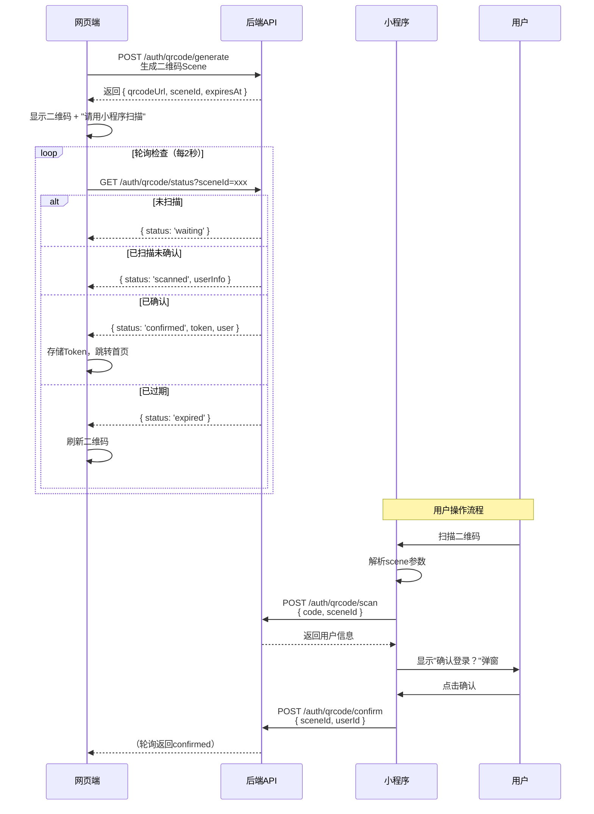

# 时光绿径待办 - 网页版开发架构规范

> **文档版本**：v1.2.0
> **创建日期**：2026-04-05\
> **适用范围**：网页端全量开发、团队协作、代码审查\
> **维护标准**：企业级大厂规范\
> **重要提示**：开发过程中遇到细节决策点，必须立即向项目负责人确认

***

## 📋 文档导航

| 章节                   | 内容概述                                 | 目标读者     |
| -------------------- | ------------------------------------ | -------- |
| [1. 架构总览](#1-架构总览)   | 技术选型、系统架构图、设计理念、**认证体系（已确认）**        | 全体开发者    |
| [2. 设计系统](#2-设计系统)   | 色彩、字体、间距、组件规范、**响应式断点（已确认）**         | UI/UX、前端 |
| [3. 项目结构](#3-项目结构)   | 目录组织、模块划分、命名规范                       | 全体开发者    |
| [4. 路由体系](#4-路由体系)   | 页面路由、权限控制、导航结构                       | 前端开发     |
| [5. 组件架构](#5-组件架构)   | 组件层级、状态管理、通信模式                       | 前端开发     |
| [6. API集成](#6-api集成) | 数据流、请求封装、错误处理、**WebSocket实时协作（已确认）** | 前端+后端    |
| [7. 样式系统](#7-样式系统)   | CSS方案、主题定制、**暗色主题（已确认）**             | UI/前端    |
| [8. 开发规范](#8-开发规范)   | Git流程、代码质量、性能优化、安全规范                 | 全体开发者    |

### ✅ 已确认的核心决策

| 决策项                 | 确认结果                       | 实现章节            |
| ------------------- | -------------------------- | --------------- |
| **主要登录方式**          | **二维码扫码登录**                | 1.5 认证体系设计      |
| **暗色主题支持**          | **需要（完整实现）**               | 7.2 暗色主题系统      |
| **移动端适配**           | **需要 + 响应式（Mobile-First）** | 2.3 响应式断点       |
| **实时协作(WebSocket)** | **需要（首期包含）**               | 6.4 WebSocket架构 |

***

## 1. 架构总览

### 1.1 技术栈决策矩阵

#### 核心技术栈（已确认）

| 维度          | 选型方案                | 版本要求    | 选择理由                  |
| ----------- | ------------------- | ------- | --------------------- |
| **前端框架**    | React 18            | ^18.2.0 | 并发特性、Suspense、自动批处理   |
| **开发语言**    | TypeScript          | ^5.0.0  | 类型安全、IDE支持、重构友好       |
| **构建工具**    | Vite                | ^5.0.0  | 极速HMR、ESM原生、插件生态      |
| **UI组件库**   | Ant Design 5        | ^5.12.0 | 企业级组件、主题定制能力强         |
| **状态管理**    | Zustand             | ^4.5.0  | 轻量、TS友好、无Boilerplate  |
| **路由管理**    | React Router v6     | ^6.20.0 | 嵌套路由、Loader/Action    |
| **HTTP客户端** | Axios               | ^1.6.0  | 拦截器、取消请求、TypeScript支持 |
| **日期处理**    | dayjs               | ^1.11.0 | 与小程序统一、轻量、插件丰富        |
| **图表库**     | ECharts for React   | ^6.0.0  | 与小程序统一、可视化强大          |
| **CSS方案**   | CSS Modules + Token | -       | 样式隔离、主题变量             |

#### 辅助依赖（按需引入）

| 用途    | 库名                        | 说明             |
| ----- | ------------------------- | -------------- |
| 表单验证  | @hookform/resolvers + zod | 类型安全的表单校验      |
| 拖拽排序  | @dnd-kit/core             | 现代化拖拽库，性能优秀    |
| 虚拟列表  | @tanstack/react-virtual   | 长列表性能优化        |
| 图标库   | @ant-design/icons         | Ant Design官方图标 |
| 工具库   | lodash-es                 | 按需引入的工具函数      |
| 加密库   | crypto-js                 | 与小程序统一的加密方案    |
| 二维码生成 | qrcode.react              | 邀请码二维码展示       |

### 1.2 系统架构图

```
┌─────────────────────────────────────────────────────────────────┐
│                      用户浏览器 (Client)                         │
│  ┌──────────────────────────────────────────────────────────┐   │
│  │                    React Application                       │   │
│  │  ┌─────────────┐ ┌─────────────┐ ┌─────────────────────┐  │   │
│  │  │  Pages层    │ │ Components层│ │     Hooks层         │  │   │
│  │  │ (路由页面)   │ │ (业务组件)   │ │ (自定义Hooks)       │  │   │
│  │  └──────┬──────┘ └──────┬──────┘ └──────────┬──────────┘  │   │
│  │         │               │                     │           │   │
│  │  ┌──────▼───────────────▼─────────────────────▼──────────┐ │   │
│  │  │                  State Management (Zustand)            │ │   │
│  │  │  ┌─────────┐ ┌─────────┐ ┌─────────┐ ┌───────────┐  │ │   │
│  │  │  │ authStore│ │todoStore│ │uiStore  │ │comboStore │  │ │   │
│  │  │  └─────────┘ └─────────┘ └─────────┘ └───────────┘  │ │   │
│  │  └────────────────────────┬─────────────────────────────┘ │   │
│  │                           │                               │   │
│  │  ┌────────────────────────▼─────────────────────────────┐ │   │
│  │  │              API Service Layer (Axios)                │ │   │
│  │  │  ┌──────────┐ ┌──────────┐ ┌──────────────────────┐  │ │   │
│  │  │  │ 拦截器    │ │ 请求封装  │ │ 错误处理 & 重试机制  │  │ │   │
│  │  │  └──────────┘ └──────────┘ └──────────────────────┘  │ │   │
│  │  └────────────────────────┬─────────────────────────────┘ │   │
│  └───────────────────────────┼───────────────────────────────┘   │
└──────────────────────────────┼──────────────────────────────────┘
                               │ HTTPS / WebSocket
┌──────────────────────────────▼──────────────────────────────────┐
│                      后端API服务 (已有)                          │
│              https://api.yzjtiantian.cn                         │
│  ┌──────────────────────────────────────────────────────────┐   │
│  │                   Express.js + Middlewares                │   │
│  │      JWT认证 │ CORS │ 日志 │ 权限校验 │ 限流              │   │
│  └────────────────────────┬─────────────────────────────────┘   │
│                           │                                     │
│  ┌────────────────────────▼─────────────────────────────────┐   │
│  │                 Business Controllers                      │   │
│  │  Todo │ Combo │ Collab │ Auth │ Tag │ Notify │ Admin     │   │
│  └────────────────────────┬─────────────────────────────────┘   │
│                           │                                     │
│  ┌────────────────────────▼─────────────────────────────────┐   │
│  │                    MySQL Database                         │   │
│  └──────────────────────────────────────────────────────────┘   │
└─────────────────────────────────────────────────────────────────┘
```

### 1.3 架构设计原则

#### 核心设计理念

1. **渐进增强 (Progressive Enhancement)**
   - P0功能优先上线，P1/P2分阶段迭代
   - 核心路径流畅，高级功能可降级
   - 移动端适配优先（Mobile-First）
2. **一致性 (Consistency)**
   - 与小程序保持视觉风格一致（绿色主题）
   - API接口复用后端现有接口
   - 数据模型与小程序完全对齐
3. **可维护性 (Maintainability)**
   - TypeScript严格模式
   - 组件高度解耦，单一职责
   - 清晰的目录结构和命名规范
4. **性能优先 (Performance First)**
   - 代码分割（Code Splitting）
   - 虚拟滚动长列表
   - 图片懒加载和压缩
   - 缓存策略优化
5. **安全合规 (Security)**
   - XSS防护（React自动转义）
   - CSRF Token
   - 敏感数据加密传输
   - 权限细粒度控制

### 1.4 功能迁移策略（全量覆盖）

#### Phase 1: 核心基础（P0） - MVP版本

**目标**：实现核心待办管理闭环

| 功能模块     | 优先级    | 复杂度    | 预估工时    |
| -------- | ------ | ------ | ------- |
| 用户认证系统   | P0     | 中      | 3天      |
| 待办CRUD   | P0     | 高      | 5天      |
| 组合管理（私有） | P0     | 中      | 3天      |
| 标签系统     | P0     | 低      | 2天      |
| 日历视图     | P0     | 中      | 4天      |
| 云端同步     | P0     | 高      | 4天      |
| 基础搜索     | P0     | 低      | 1天      |
| 回收站      | P0     | 低      | 2天      |
| **小计**   | <br /> | <br /> | **24天** |

#### Phase 2: 增强功能（P1） - 完整体验

**目标**：补齐统计分析与协作能力

| 功能模块           | 优先级    | 复杂度    | 预估工时    |
| -------------- | ------ | ------ | ------- |
| 数据统计与图表        | P1     | 高      | 5天      |
| 协作功能（共享组合）     | P1     | 很高     | 8天      |
| 评论功能           | P2     | 中      | 3天      |
| 通知提醒（Web Push） | P1     | 高      | 4天      |
| 收藏功能           | P2     | 低      | 1天      |
| 位置信息集成         | P1     | 中      | 3天      |
| 数据导入导出         | P1     | 中      | 3天      |
| **小计**         | <br /> | <br /> | **27天** |

#### Phase 3: 辅助工具（P2） - 体验完善

**目标**：提供增值工具和运营能力

| 功能模块     | 优先级    | 复杂度    | 预估工时      |
| -------- | ------ | ------ | --------- |
| 密码生成器    | P2     | 低      | 1天        |
| 今天吃什么    | P2     | 低      | 0.5天      |
| 每日激励     | P2     | 低      | 0.5天      |
| 致谢名单     | P2     | 低      | 0.5天      |
| 公告系统     | P2     | 低      | 1天        |
| 版本更新日志   | P2     | 低      | 1天        |
| AI助手（可选） | P2     | 高      | 5天        |
| 管理后台     | P2     | 高      | 7天        |
| **小计**   | <br /> | <br /> | **16.5天** |

**总计预估**：67.5个工作日（约13.5周，3人团队约4.5周）

### 1.5 认证体系设计（**已确认：以二维码扫码为主**）

#### ✅ 核心决策（项目负责人确认）

| 决策项                 | 确认结果         | 说明                       |
| ------------------- | ------------ | ------------------------ |
| **主要登录方式**          | **二维码扫码登录**  | 首页默认展示二维码，账号密码为备选        |
| **暗色主题支持**          | **需要**       | 完整实现亮/暗主题切换              |
| **国际化(i18n)**       | **需要**       | 支持多语言切换                  |
| **移动端适配**           | **需要 + 响应式** | Mobile-First设计 + 独立移动端布局 |
| **实时协作(WebSocket)** | **需要**       | 首期包含WebSocket实时同步        |

#### 认证方式优先级

```
用户登录入口
    │
    ├── ★ 方式一：小程序扫码登录（主要方式）
    │   ├── 首页默认展示二维码（大尺寸、居中）
    │   ├── 二维码含唯一scene标识
    │   ├── 用户用微信扫描二维码
    │   ├── 小程序内接收scene参数 → 调用wx.login()
    │   ├── 小程序将code+scene发送到后端验证
    │   ├── 后端验证 → 关联用户 → JWT Token
    │   ├── 网页通过轮询/WebSocket等待登录结果
    │   └── 获取Token完成登录 → 跳转首页
    │
    └── 方式二：账号密码登录（备选方式）
        ├── "使用账号密码登录"链接（次要入口）
        ├── 输入账号ID（或手机号/邮箱）
        ├── 输入密码
        ├── 后端验证 → JWT Token
        └── 存储到 localStorage + Cookie
```

#### 扫码登录详细流程（重点）



#### Token管理策略

```typescript
// Token存储结构
interface AuthState {
  token: string;           // JWT访问令牌
  refreshToken?: string;   // 刷新令牌（可选）
  expiresAt: number;       // 过期时间戳
  user: UserInfo;          // 当前用户信息
  loginMethod: 'password' | 'qrcode' | 'sms'; // 登录方式
}

// 存储策略
const TOKEN_STORAGE = {
  primary: 'localStorage',  // 主要存储（持久化）
  fallback: 'cookie',       // 备用存储（跨标签页同步）
  memory: 'zustand',        // 内存缓存（运行时快速访问）
};
```

***

## 2. 设计系统（Design System）

### 2.1 Design Tokens 定义

基于小程序现有风格，定义完整的 Design Tokens 体系。

#### 2.1.1 色彩系统（Color Tokens）

##### 主色调（Primary Colors）

```css
:root {
  /* ===== 主色系 - 清新绿 ===== */
  --color-primary: #00b26a;              /* 主色 - 品牌核心色 */
  --color-primary-hover: #009a5c;        /* 主色悬停 */
  --color-primary-active: #008550;       /* 主色激活 */
  --color-primary-disabled: #a3d4bc;     /* 主色禁用 */
  
  /* 主色渐变 */
  --gradient-primary: linear-gradient(135deg, #00b26a 0%, #3ddaa0 100%);
  --gradient-primary-light: linear-gradient(135deg, #e0f2ec 0%, #f0faf5 100%);
  
  /* 主色透明度变体 */
  --color-primary-1: #e0f2ec;            /* 10% - 背景色 */
  --color-primary-2: #b3e6d1;            /* 25% - 浅背景 */
  --color-primary-3: #80d9b5;            /* 50% - 边框 */
  --color-primary-4: #4dcb99;            /* 75% - 强调 */
  --color-primary-5: #00b26a;            /* 100% - 标准主色 */
  --color-primary-6: #009a5c;            /* 125% - 深色 */
  --color-primary-7: #00804e;            /* 150% */
  --color-primary-8: #006640;            /* 175% */
  --color-primary-9: #004c30;            /* 200% - 最深 */
}
```

##### 功能色（Semantic Colors）

```css
:root {
  /* ===== 成功色 ===== */
  --color-success: #52c41a;
  --color-success-bg: #f6ffed;
  --color-success-border: #b7eb8f;
  
  /* ===== 警告色 ===== */
  --color-warning: #faad14;
  --color-warning-bg: #fffbe6;
  --color-warning-border: #ffe58f;
  
  /* ===== 错误色 ===== */
  --color-error: #ff4d4f;
  --color-error-bg: #fff2f0;
  --color-error-border: #ffccc7;
  
  /* ===== 信息色 ===== */
  --color-info: #1890ff;
  --color-info-bg: #e6f7ff;
  --color-info-border: #91d5ff;
  
  /* ===== 链接色 ===== */
  --color-link: #00b26a;
  --color-link-hover: #008550;
}
```

##### 中性色（Neutral Colors）

```css
:root {
  /* ===== 文本色 ===== */
  --color-text-primary: #1a1a1a;          /* 主文本 - 标题 */
  --color-text-secondary: #595959;        /* 次要文本 - 正文 */
  --color-text-tertiary: #8c8c8c;         /* 辅助文本 - 说明 */
  --color-text-quaternary: #bfbfbf;       /* 占位文本 */
  --color-text-disabled: #d9d9d9;         /* 禁用文本 */
  
  /* ===== 边框色 ===== */
  --color-border: #d9d9d9;                /* 标准边框 */
  --color-border-secondary: #f0f0f0;      /* 分割线 */
  --color-border-active: #00b26a;         /* 激活边框 */
  
  /* ===== 背景色 ===== */
  --color-bg-page: #f5f5f5;               /* 页面背景 */
  --color-bg-container: #ffffff;          /* 容器背景 */
  --color-bg-elevated: #ffffff;           /* 浮层背景（弹窗） */
  --color-bg-spotlight: #e0f2ec;          /* 高亮背景 */
  --color-bg-mask: rgba(0, 0, 0, 0.45);  /* 遮罩背景 */
  
  /* ===== 阴影 ===== */
  --shadow-sm: 0 1px 2px 0 rgba(0, 0, 0, 0.03),
               0 1px 6px -1px rgba(0, 0, 0, 0.02),
               0 2px 4px 0 rgba(0, 0, 0, 0.02);
  --shadow-md: 0 3px 6px -4px rgba(0, 0, 0, 0.12),
               0 6px 16px 0 rgba(0, 0, 0, 0.08),
               0 9px 28px 0 rgba(0, 0, 0, 0.05);
  --shadow-lg: 0 6px 16px -8px rgba(0, 0, 0, 0.08),
               0 16px 32px -8px rgba(0, 0, 0, 0.08),
               0 24px 48px 16px rgba(0, 0, 0, 0.04);
}
```

##### 标签色彩（Tag Colors - 与小程序对齐）

```typescript
// src/styles/themes/tagColors.ts
export const TAG_COLORS = [
  { id: 1, name: '工作', color: '#1890ff', bgColor: '#e6f7ff' },
  { id: 2, name: '学习', color: '#722ed1', bgColor: '#f9f0ff' },
  { id: 3, name: '生活', color: '#52c41a', bgColor: '#f6ffed' },
  { id: 4, name: '娱乐', color: '#eb2f96', bgColor: '#fff0f6' },
  { id: 5, name: '健康', color: '#fa8c16', bgColor: '#fff7e6' },
  { id: 6, name: '购物', color: '#faad14', bgColor: '#fffbe6' },
  { id: 7, name: '社交', color: '#13c2c2', bgColor: '#e6fffb' },
  { id: 8, name: '旅行', color: '#2f54eb', bgColor: '#f0f5ff' },
  // 用户自定义标签颜色池
];
```

#### 2.1.2 字体系统（Typography Tokens）

```css
:root {
  /* ===== 字体家族 ===== */
  --font-family: -apple-system, BlinkMacSystemFont, 'Segoe UI',
                 Roboto, 'Helvetica Neue', Arial,
                 'Noto Sans', sans-serif, 'Apple Color Emoji',
                 'Segoe UI Emoji', 'Segoe UI Symbol',
                 'Noto Color Emoji';
  --font-family-code: 'SFMono-Regular', Consolas, 'Liberation Mono',
                      Menlo, Courier, monospace;
  
  /* ===== 字号阶梯（基于8px网格） ===== */
  --font-size-xs: 12px;      /* 0.75rem - 辅助信息 */
  --font-size-sm: 13px;      /* 0.8125rem - 次要文本 */
  --font-size-base: 14px;    /* 0.875rem - 正文标准 */
  --font-size-md: 15px;      /* 0.9375rem - 强调文本 */
  --font-size-lg: 16px;      /* 1rem - 小标题 */
  --font-size-xl: 18px;      /* 1.125rem - 标题 */
  --font-size-xxl: 20px;     /* 1.25rem - 大标题 */
  --font-size-xxxl: 24px;    /* 1.5rem - 页面标题 */
  --font-size-display: 30px; /* 1.875rem - 展示标题 */
  
  /* ===== 字重 ===== */
  --font-weight-regular: 400;
  --font-weight-medium: 500;
  --font-weight-semibold: 600;
  --font-weight-bold: 700;
  
  /* ===== 行高 ===== */
  --line-height-tight: 1.25;    /* 标题 */
  --line-height-base: 1.571;    /* 正文 */
  --line-height-relaxed: 1.75;  /* 长文本 */
  
  /* ===== 字间距 ===== */
  --letter-spacing-tight: -0.02em;
  --letter-spacing-normal: 0;
  --letter-spacing-wide: 0.05em;
}
```

#### 2.1.3 间距系统（Spacing Tokens）

```css
:root {
  /* ===== 基于4px基准的间距系统 ===== */
  --spacing-0: 0;
  --spacing-1: 4px;      /* 超小间距 */
  --spacing-2: 8px;      /* 小间距 */
  --spacing-3: 12px;     /* 次中间距 */
  --spacing-4: 16px;     /* 标准间距 */
  --spacing-5: 20px;     /* 中间距 */
  --spacing-6: 24px;     /* 大间距 */
  --spacing-8: 32px;     /* 超大间距 */
  --spacing-10: 40px;    /* 章节间距 */
  --spacing-12: 48px;    /* 区块间距 */
  --spacing-16: 64px;    /* 页面边距 */
  --spacing-20: 80px;    /* 大区块间距 */
  --spacing-24: 96px;    /* 全屏边距 */
}

/* 语义化间距别名 */
:root {
  --gap-xs: var(--spacing-1);
  --gap-sm: var(--spacing-2);
  --gap-md: var(--spacing-3);
  --gap-base: var(--spacing-4);
  --gap-lg: var(--spacing-6);
  --gap-xl: var(--spacing-8);
  --gap-xxl: var(--spacing-12);
  
  --padding-container: var(--spacing-6);   /* 容器内边距 */
  --padding-card: var(--spacing-5);        /* 卡片内边距 */
  --padding-page: var(--spacing-6);        /* 页面左右边距 */
}
```

#### 2.1.4 圆角系统（Border Radius）

```css
:root {
  --radius-none: 0;
  --radius-sm: 4px;       /* 小元素 */
  --radius-base: 6px;     /* 标准（按钮、输入框） */
  --radius-md: 8px;       /* 中等（卡片） */
  --radius-lg: 12px;      /* 大卡片 */
  --radius-xl: 16px;      /* 弹窗 */
  --radius-xxl: 24px;     /* 特殊容器 */
  --radius-full: 9999px;  /* 圆形（头像、标签） */
}
```

#### 2.1.5 动效系统（Animation/Easing）

```css
:root {
  /* ===== 动画时长 ===== */
  --duration-fast: 150ms;      /* 微交互（hover、focus） */
  --duration-base: 200ms;      /* 基础动画 */
  --duration-slow: 300ms;      /* 过渡动画 */
  --duration-slower: 500ms;    /* 页面切换 */
  --duration-entering: 200ms;  /* 进入动画 */
  --duration-leaving: 150ms;   /* 离开动画 */
  
  /* ===== 缓动函数 ===== */
  --ease-in: cubic-bezier(0.4, 0, 1, 1);
  --ease-out: cubic-bezier(0, 0, 0.2, 1);
  --ease-in-out: cubic-bezier(0.4, 0, 0.2, 1);
  --ease-spring: cubic-bezier(0.34, 1.56, 0.64, 1); /* 弹性 */
  
  /* ===== 动画组合 ===== */
  --transition-fast: all var(--duration-fast) var(--ease-in-out);
  --transition-base: all var(--duration-base) var(--ease-in-out);
  --transition-slow: all var(--duration-slow) var(--ease-in-out);
}
```

### 2.2 组件规范（Component Specifications）

#### 2.2.1 Ant Design 5 主题定制

```typescript
// src/styles/theme/index.ts
import type { ThemeConfig } from 'antd';

const theme: ThemeConfig = {
  token: {
    // === 品牌色定制 ===
    colorPrimary: '#00b26a',
    colorSuccess: '#52c41a',
    colorWarning: '#faad14',
    colorError: '#ff4d4f',
    colorInfo: '#1890ff',
    colorLink: '#00b26a',
    
    // === 字体定制 ===
    fontFamily: `-apple-system, BlinkMacSystemFont, 'Segoe UI', Roboto, sans-serif`,
    fontSize: 14,
    fontSizeLG: 16,
    fontSizeSM: 12,
    fontSizeHeading1: 30,
    fontSizeHeading2: 24,
    fontSizeHeading3: 20,
    fontSizeHeading4: 18,
    lineHeight: 1.571,
    lineHeightLG: 1.5,
    lineHeightSM: 1.667,
    
    // === 圆角 ===
    borderRadius: 6,
    borderRadiusSM: 4,
    borderRadiusLG: 8,
    
    // === 间距 ===
    padding: 16,
    paddingSM: 12,
    paddingLG: 24,
    margin: 16,
    marginSM: 12,
    marginLG: 24,
    
    // === 阴影 ===
    boxShadow: `0 3px 6px -4px rgba(0, 0, 0, 0.12), 
                0 6px 16px 0 rgba(0, 0, 0, 0.08), 
                0 9px 28px 0 rgba(0, 0, 0, 0.05)`,
    boxShadowSecondary: `0 6px 16px -8px rgba(0, 0, 0, 0.08), 
                         0 16px 32px -8px rgba(0, 0, 0, 0.08), 
                         0 24px 48px 16px rgba(0, 0, 0, 0.04)`,
    
    // === 控件高度 ===
    controlHeight: 36,
    controlHeightSM: 28,
    controlHeightLG: 44,
    
    // === 动画 ===
    motionDurationFast: '0.15s',
    motionDurationMid: '0.2s',
    motionDurationSlow: '0.3s',
    motionEaseInOut: cubicBezier(0.4, 0, 0.2, 1),
    motionEaseOut: cubicBezier(0, 0, 0.2, 1),
    motionEaseIn: cubicBezier(0.4, 0, 1, 1),
  },
  components: {
    Button: {
      primaryShadow: `0 2px 0 rgba(0, 178, 106, 0.15)`,
      defaultBg: '#ffffff',
      defaultBorderColor: '#d9d9d9',
      contentFontSizeLG: 16,
    },
    Card: {
      paddingLG: 24,
      borderRadiusLG: 12,
    },
    Input: {
      activeBorderColor: '#00b26a',
      hoverBorderColor: '#3ddaa0',
      activeShadow: `0 0 0 2px rgba(0, 178, 106, 0.1)`,
    },
    Table: {
      headerBg: '#fafafa',
      rowHoverBg: '#e0f2ec',
      borderColor: '#f0f0f0',
    },
    Modal: {
      borderRadiusLG: 16,
    },
    Menu: {
      itemActiveBg: '#e0f2ec',
      itemSelectedBg: '#e0f2ec',
      itemSelectedColor: '#00b26a',
    },
    Tag: {
      defaultBg: '#f0faf5',
      defaultColor: '#00b26a',
    },
  },
};

export default theme;
```

#### 2.2.2 核心业务组件清单

| 组件名称            | 类型   | 来源 | 使用场景  | 规范说明                    |
| --------------- | ---- | -- | ----- | ----------------------- |
| TodoCard        | 业务组件 | 自研 | 待办列表项 | 支持拖拽、滑动操作、多选            |
| ComboCard       | 业务组件 | 自研 | 组合卡片  | 显示图标、颜色、待办数             |
| TagBadge        | 展示组件 | 自研 | 标签徽章  | 圆角胶囊样式                  |
| CalendarView    | 复合组件 | 封装 | 日历视图  | 集成@lspriv/wx-calendar逻辑 |
| StatsChart      | 复合组件 | 封装 | 统计图表  | ECharts封装               |
| QrCodeLogin     | 业务组件 | 自研 | 扫码登录  | 二维码+状态轮询                |
| MemberAvatar    | 展示组件 | 自研 | 成员头像  | 支持角色标识                  |
| EmptyState      | 展示组件 | 自研 | 空状态页  | 符合品牌风格                  |
| LoadingSkeleton | 展示组件 | 自研 | 骨架屏   | 渐进式加载                   |

### 2.3 响应式断点（Breakpoints）（**已确认：Mobile-First + 独立移动端布局**）

#### ✅ 响应式设计决策（项目负责人确认）

| 决策项      | 确认结果              | 说明                |
| -------- | ----------------- | ----------------- |
| **设计策略** | **Mobile-First**  | 从小屏幕开始，向上增强       |
| **布局模式** | **响应式 + 独立移动端组件** | 桌面端侧边栏 + 移动端底部Tab |
| **断点系统** | 6级断点              | 覆盖手机到大屏显示器        |

```typescript
// src/styles/breakpoints.ts
export const BREAKPOINTS = {
  xs: '480px',    // 手机竖屏 (iPhone SE)
  sm: '576px',    // 手机横屏 / 大屏手机
  md: '768px',    // 平板竖屏 (iPad)
  lg: '992px',    // 平板横屏 / 小型笔记本
  xl: '1200px',   // 桌面显示器
  xxl: '1600px',  // 大屏显示器
} as const;

// 设备类型判断
type DeviceType = 'mobile' | 'tablet' | 'desktop' | 'large';

export const getDeviceType = (width: number): DeviceType => {
  if (width < BREAKPOINTS.md) return 'mobile';
  if (width < BREAKPOINTS.lg) return 'tablet';
  if (width < BREAKPOINTS.xxl) return 'desktop';
  return 'large';
};
```

#### 2.3.1 Mobile-First 设计原则

```css
/* ✅ 正确：Mobile-First（从小屏幕开始） */
.container {
  /* 移动端默认样式 */
  width: 100%;
  padding: var(--spacing-sm);
  flex-direction: column;
  
  /* 平板及以上 */
  @media (min-width: ${BREAKPOINTS.md}) {
    padding: var(--spacing-md);
    flex-direction: row;
  }
  
  /* 桌面及以上 */
  @media (min-width: ${BREAKPOINTS.lg}) {
    padding: var(--spacing-lg);
    max-width: 1200px;
    margin: 0 auto;
  }
}

/* ❌ 错误：Desktop-First（从大屏幕开始） */
.container {
  max-width: 1200px;
  margin: 0 auto;
  padding: var(--spacing-lg);
  flex-direction: row;
  
  @media (max-width: ${BREAKPOINTS.lg}) { /* ... */ }
}
```

#### 2.3.2 响应式Hook实现

```typescript
// src/hooks/useMediaQuery.ts
import { useState, useEffect } from 'react';
import { BREAKPOINTS } from '@/styles/breakpoints';

/**
 * 媒体查询Hook - 监听屏幕尺寸变化
 * @param query CSS媒体查询字符串
 * @returns 是否匹配当前媒体查询
 */
export function useMediaQuery(query: string): boolean {
  const [matches, setMatches] = useState(() => 
    window.matchMedia(query).matches
  );

  useEffect(() => {
    const mediaQuery = window.matchMedia(query);
    const handler = (event: MediaQueryListEvent) => setMatches(event.matches);
    
    mediaQuery.addEventListener('change', handler);
    return () => mediaQuery.removeEventListener('change', handler);
  }, [query]);

  return matches;
}

/**
 * 设备类型Hook - 返回当前设备类型
 */
export function useDeviceType() {
  const isMobile = useMediaQuery(`(max-width: ${BREAKPOINTS.md})`);
  const isTablet = useMediaQuery(
    `(min-width: ${BREAKPOINTS.md}) and (max-width: ${BREAKPOINTS.lg})`
  );
  const isDesktop = useMediaQuery(`(min-width: ${BREAKPOINTS.lg})`);
  
  return {
    isMobile,
    isTablet,
    isDesktop,
    deviceType: isMobile ? 'mobile' : isTablet ? 'tablet' : 'desktop',
  };
}

// 使用示例
// const { isMobile, isDesktop } = useDeviceType();
// if (isMobile) return <MobileLayout />;
// if (isDesktop) return <DesktopLayout />;
```

#### 2.3.3 布局切换策略

```tsx
// src/components/layout/AppLayout/AppLayout.tsx
import React from 'react';
import { useDeviceType } from '@/hooks/useMediaQuery';
import DesktopLayout from './DesktopLayout';
import MobileLayout from './MobileLayout';

const AppLayout: React.FC<{ children: React.ReactNode }> = ({ children }) => {
  const { isMobile, deviceType } = useDeviceType();

  // 根据设备类型渲染不同布局
  if (isMobile) {
    return (
      <MobileLayout deviceType={deviceType}>
        {children}
      </MobileLayout>
    );
  }

  return (
    <DesktopLayout deviceType={deviceType}>
      {children}
    </DesktopLayout>
  );
};

export default AppLayout;
```

**桌面端布局结构**：

```
┌─────────────────────────────────────────────────┐
│  Header (固定顶部，高度64px)                     │
├──────────┬──────────────────────────────────────┤
│          │                                      │
│ Sidebar  │         Main Content                 │
│ (240px)  │         (自适应宽度)                  │
│          │                                      │
│          │                                      │
├──────────┴──────────────────────────────────────┤
│  Footer (可选，固定底部或跟随内容)               │
└─────────────────────────────────────────────────┘
```

**移动端布局结构**：

```
┌─────────────────────┐
│  Header (固定顶部)   │
├─────────────────────┤
│                     │
│   Main Content      │
│   (全宽滚动区域)     │
│                     │
│                     │
├─────────────────────┤
│ TabBar (固定底部)   │
│ 首页 | 日历 | 统计 | 我的 │
└─────────────────────┘
```

#### 2.3.4 移动端底部Tab配置

```typescript
// src/config/mobileTabs.ts
import type { ReactNode } from 'react';
import {
  HomeOutlined,
  CalendarOutlined,
  BarChartOutlined,
  UserOutlined,
} from '@ant-design/icons';

export interface MobileTabItem {
  key: string;
  label: string;           // 显示文字
  icon: ReactNode;         // 图标
  path: string;            // 路由路径
  permission?: string;     // 权限标识（可选）
}

export const mobileTabs: MobileTabItem[] = [
  {
    key: 'home',
    label: '首页',
    icon: <HomeOutlined />,
    path: '/todo',
  },
  {
    key: 'calendar',
    label: '日历',
    icon: <CalendarOutlined />,
    path: '/calendar',
  },
  {
    key: 'stats',
    label: '统计',
    icon: <BarChartOutlined />,
    path: '/stats',
  },
  {
    key: 'user',
    label: '我的',
    icon: <UserOutlined />,
    path: '/user-center',
  },
];
```

#### 2.3.5 响应式组件示例

```tsx
// src/components/business/TodoList/TodoList.tsx
import React from 'react';
import { useDeviceType } from '@/hooks/useMediaQuery';
import TodoCard from '../TodoCard/TodoCard';
import TodoListItem from './TodoListItem'; // 移动端列表项样式
import styles from './TodoList.module.css';

const TodoList: React.FC<TodoListProps> = ({ todos }) => {
  const { isMobile, isTablet } = useDeviceType();

  return (
    <div className={`${styles.list} ${isMobile ? styles.mobile : ''}`}>
      {todos.map(todo => (
        isMobile || isTablet ? (
          <TodoListItem key={todo.id} todo={todo} />
        ) : (
          <TodoCard key={todo.id} todo={todo} />
        )
      ))}
    </div>
  );
};

/* TodoList.module.css */
.list {
  display: grid;
  gap: var(--spacing-base);
  
  /* 桌面端：卡片网格布局 */
  grid-template-columns: repeat(auto-fill, minmax(350px, 1fr));
  
  &.mobile {
    /* 移动端：单列列表布局 */
    grid-template-columns: 1fr;
    gap: 0;
    border-top: 1px solid var(--color-border);
  }
}
```

#### 2.3.6 触摸优化（移动端专用）

```css
/* 触摸目标尺寸（Apple HIG建议：44pt × 44pt） */
.touchable {
  min-height: 44px;
  min-width: 44px;
  padding: 12px 16px;
  
  /* 触摸反馈 */
  &:active {
    opacity: 0.7;
    transform: scale(0.98);
    transition: all 0.1s ease;
  }
}

/* 滑动手势支持 */
.swipeable {
  touch-action: pan-y; /* 允许垂直滚动，禁止水平滑动（由JS处理） */
  user-select: none; /* 防止长按选中文本 */
  -webkit-user-drag: none;
}

/* 安全区域适配（刘海屏/底部横条） */
@supports (padding-bottom: env(safe-area-inset-bottom)) {
  .mobile-safe-bottom {
    padding-bottom: calc(env(safe-area-inset-bottom) + 16px);
  }
  
  .tab-bar-fixed {
    height: calc(56px + env(safe-area-inset-bottom));
    padding-bottom: env(safe-area-inset-bottom);
  }
}
```

***

## 3. 项目结构（Project Structure）

### 3.1 目录组织规范

```
timegreen-web/
├── public/                          # 静态资源
│   ├── favicon.ico
│   ├── logo.svg
│   └── robots.txt
│
├── src/                             # 源代码目录
│   ├── assets/                      # 静态资源（图片、字体等）
│   │   ├── images/                  # 图片资源
│   │   │   ├── logo/                # Logo相关
│   │   │   ├── icons/               # 图标资源
│   │   │   └── illustrations/       # 插画素材
│   │   └── fonts/                   # 字体文件
│   │
│   ├── components/                  # 通用组件库
│   │   ├── ui/                      # 基础UI组件（原子组件）
│   │   │   ├── Button/              # 按钮封装
│   │   │   │   ├── index.tsx
│   │   │   │   ├── Button.tsx
│   │   │   │   ├── Button.types.ts
│   │   │   │   ├── Button.module.css
│   │   │   │   └── __tests__/
│   │   │   ├── Card/                # 卡片封装
│   │   │   ├── Input/               # 输入框封装
│   │   │   ├── Modal/               # 弹窗封装
│   │   │   ├── Tag/                 # 标签组件
│   │   │   └── Avatar/              # 头像组件
│   │   │
│   │   ├── business/                # 业务组件（复合组件）
│   │   │   ├── TodoCard/            # 待办卡片
│   │   │   ├── ComboCard/           # 组合卡片
│   │   │   ├── CalendarView/        # 日历视图
│   │   │   ├── StatsChart/          # 统计图表
│   │   │   ├── MemberList/          # 成员列表
│   │   │   └── QrCodeLogin/         # 扫码登录
│   │   │
│   │   └── layout/                  # 布局组件
│   │       ├── AppLayout/           # 应用主布局
│   │       ├── Header/              # 顶部导航栏
│   │       ├── Sidebar/             # 侧边栏
│   │       ├── Footer/              # 底部栏
│   │       └── TabBar/              # 移动端底部Tab
│   │
│   ├── pages/                       # 页面组件（路由级别）
│   │   ├── auth/                    # 认证相关页面
│   │   │   ├── Login/               # 登录页
│   │   │   ├── Register/            # 注册页
│   │   │   └── ForgotPassword/      # 忘记密码
│   │   │
│   │   ├── todo/                    # 待办管理
│   │   │   ├── TodoList/            # 待办列表（首页）
│   │   │   ├── AddTodo/             # 添加/编辑待办
│   │   │   ├── TodoDetail/          # 待办详情
│   │   │   └── TodoSearch/          # 搜索结果
│   │   │
│   │   ├── combo/                   # 组合管理
│   │   │   ├── ComboList/           # 组合列表
│   │   │   ├── ComboEdit/           # 创建/编辑组合
│   │   │   ├── ComboDetail/         # 组合详情
│   │   │   └── ComboStats/          # 组合统计
│   │   │
│   │   ├── calendar/                # 日历视图
│   │   │   └── CalendarView/        # 日历主页
│   │   │
│   │   ├── stats/                   # 数据统计
│   │   │   ├── StatsOverview/       # 统计概览
│   │   │   └── DailyStats/          # 每日统计
│   │   │
│   │   ├── collaboration/           # 协作功能
│   │   │   ├── CollaborationManage/ # 协作管理
│   │   │   ├── JoinCollab/          # 加入协作
│   │   │   └── MemberManage/        # 成员管理
│   │   │
│   │   ├── tag/                     # 标签管理
│   │   │   └── TagManage/           # 标签管理页
│   │   │
│   │   ├── tools/                   # 工具集
│   │   │   ├── PasswordGenerator/   # 密码生成器
│   │   │   ├── Eating/              # 今天吃什么
│   │   │   ├── Motivation/          # 每日激励
│   │   │   ├── Star/                # 收藏夹
│   │   │   └── Acknowledge/         # 致谢名单
│   │   │
│   │   ├── data/                    # 数据管理
│   │   │   ├── DataManage/          # 导入导出
│   │   │   └── Trash/               # 回收站
│   │   │
│   │   ├── user/                    # 用户中心
│   │   │   ├── UserCenter/          # 用户中心
│   │   │   └── Settings/            # 设置页
│   │   │
│   │   ├── system/                  # 系统页面
│   │   │   ├── Notice/              # 公告页
│   │   │   ├── Changelog/           # 更新日志
│   │   │   └── Guide/               # 引导页
│   │   │
│   │   └── admin/                   # 管理后台（Phase 3）
│   │       ├── AdminDashboard/      # 管理面板
│   │       ├── UserManagement/      # 用户管理
│   │       └── NoticeManagement/     # 公告管理
│   │
│   ├── hooks/                        # 自定义Hooks
│   │   ├── useAuth.ts               # 认证状态
│   │   ├── useTodo.ts               # 待办操作
│   │   ├── useCombo.ts              # 组合操作
│   │   ├── useSync.ts               # 云同步
│   │   ├── usePermission.ts         # 权限控制
│   │   ├── useMediaQuery.ts         # 响应式查询
│   │   └── useDebounce.ts           # 防抖
│   │
│   ├── stores/                       # Zustand状态管理
│   │   ├── authStore.ts             # 认证状态
│   │   ├── todoStore.ts             # 待办状态
│   │   ├── comboStore.ts            # 组合状态
│   │   ├── tagStore.ts              # 标签状态
│   │   ├── uiStore.ts               # UI状态（侧边栏、Modal等）
│   │   └── index.ts                 # Store统一导出
│   │
│   ├── services/                     # API服务层
│   │   ├── api/                     # API实例配置
│   │   │   ├── axios.ts             # Axios实例
│   │   │   ├── interceptors.ts      # 拦截器配置
│   │   │   └── types.ts             # API类型定义
│   │   │
│   │   ├── modules/                 # 业务API模块
│   │   │   ├── authApi.ts           # 认证API
│   │   │   ├── todoApi.ts           # 待办API
│   │   │   ├── comboApi.ts          # 组合API
│   │   │   ├── collabApi.ts         # 协作API
│   │   │   ├── tagApi.ts            # 标签API
│   │   │   ├── statsApi.ts          # 统计API
│   │   │   ├── notifyApi.ts         # 通知API
│   │   │   └── uploadApi.ts         # 上传API
│   │   │
│   │   └── types/                   # 服务层类型
│   │       ├── request.ts           # 请求响应类型
│   │       └── error.ts             # 错误类型
│   │
│   ├── utils/                        # 工具函数
│   │   ├── format.ts                # 格式化函数
│   │   ├── validate.ts              # 校验函数
│   │   ├── storage.ts               # 本地存储封装
│   │   ├── crypto.ts                # 加密解密
│   │   ├── constants.ts             # 常量定义
│   │   └── helpers.ts               # 通用辅助函数
│   │
│   ├── styles/                       # 样式文件
│   │   ├── theme/                   # 主题配置
│   │   │   ├── index.ts            # 主题入口
│   │   │   ├── tokens.ts           # Design Tokens
│   │   │   └── overrides.ts        # Ant Design覆盖
│   │   │
│   │   ├── global.css              # 全局样式
│   │   ├── variables.css           # CSS变量
│   │   ├── reset.css               # 样式重置
│   │   └── animations.css          # 动画定义
│   │
│   ├── types/                        # 全局类型定义
│   │   ├── todo.ts                  # 待办类型
│   │   ├── combo.ts                 # 组合类型
│   │   ├── user.ts                  # 用户类型
│   │   ├── tag.ts                   # 标签类型
│   │   ├── api.ts                   # API通用类型
│   │   └── index.ts                 # 类型统一导出
│   │
│   ├── config/                       # 配置文件
│   │   ├── app.config.ts            # 应用配置
│   │   ├── routes.ts                # 路由配置
│   │   ├── menu.ts                  # 菜单配置
│   │   └── constants.ts             # 业务常量
│   │
│   ├── App.tsx                       # 应用根组件
│   ├── main.tsx                      # 应用入口
│   └── vite-env.d.ts               # Vite类型声明
│
├── tests/                            # 测试文件
│   ├── unit/                        # 单元测试
│   ├── integration/                 # 集成测试
│   └── e2e/                         # 端到端测试
│
├── .env                             # 环境变量（开发）
├── .env.production                  # 环境变量（生产）
├── .env.staging                     # 环境变量（预发布）
├── index.html                       # HTML模板
├── package.json                     # 项目配置
├── tsconfig.json                    # TypeScript配置
├── vite.config.ts                   # Vite配置
├── eslint.config.js                 # ESLint配置
├── prettier.config.js               # Prettier配置
├── jest.config.js                   # Jest配置（如需要）
└── README.md                        # 项目说明
```

### 3.2 文件命名规范

| 类型          | 命名规则                  | 示例                    | 说明            |
| ----------- | --------------------- | --------------------- | ------------- |
| **组件文件**    | PascalCase            | `TodoCard.tsx`        | React组件       |
| **样式文件**    | PascalCase.module.css | `TodoCard.module.css` | CSS Modules   |
| **工具函数**    | camelCase             | `formatDate.ts`       | 函数/方法         |
| **常量文件**    | camelCase             | `apiConstants.ts`     | 常量定义          |
| **类型文件**    | camelCase             | `todoTypes.ts`        | 类型定义          |
| **Hook文件**  | use开头+PascalCase      | `useAuth.ts`          | 自定义Hooks      |
| **Store文件** | camelCase+Store       | `authStore.ts`        | Zustand Store |
| **API文件**   | camelCase+Api         | `todoApi.ts`          | API模块         |
| **配置文件**    | camelCase             | `appConfig.ts`        | 配置文件          |
| **页面目录**    | PascalCase            | `TodoList/`           | 页面组件目录        |

### 3.3 组件文件结构模板

每个组件应遵循以下标准结构：

```tsx
// src/components/business/TodoCard/TodoCard.tsx
import React, { memo, FC } from 'react';
import { Checkbox, Tag, Space, Dropdown } from 'antd';
import type { Todo } from '@/types/todo';
import { useTodoStore } from '@/stores/todoStore';
import styles from './TodoCard.module.css';

interface TodoCardProps {
  todo: Todo;
  onEdit?: (todo: Todo) => void;
  onDelete?: (id: string) => void;
  onToggle?: (id: string) => void;
}

/**
 * TodoCard - 待办事项卡片组件
 * 
 * @description 用于展示单个待办事项，支持完成切换、编辑、删除等操作
 * @author TimeGreen Team
 * @version 1.0.0
 */
const TodoCard: FC<TodoCardProps> = memo(({
  todo,
  onEdit,
  onDelete,
  onToggle,
}) => {
  const { toggleComplete } = useTodoStore();

  const handleToggle = () => {
    onToggle?.(todo.id);
    toggleComplete(todo.id);
  };

  return (
    <div className={styles.container}>
      <div className={styles.header}>
        <Checkbox
          checked={!!todo.completed}
          onChange={handleToggle}
        />
        <span className={styles.text}>{todo.text}</span>
      </div>
      
      <div className={styles.footer}>
        <Space size={4}>
          {todo.tags?.map(tagId => (
            <Tag key={tagId} color="processing">
              {/* Tag渲染 */}
            </Tag>
          ))}
        </Space>
      </div>
    </div>
  );
});

TodoCard.displayName = 'TodoCard';

export default TodoCard;
```

***

## 4. 路由体系（Routing System）

### 4.1 路由配置架构

```typescript
// src/config/routes.ts
import type { RouteObject } from 'react-router-dom';
import lazy from 'react/lazy';

// 路由懒加载封装
const LazyPage = (importFn: () => Promise<{ default: FC }>) =>
  React.lazy(importFn);

// 布局组件
const AppLayout = () => import('@/components/layout/AppLayout');
const AuthLayout = () => import('@/components/layout/AuthLayout');

// 页面组件
const Login = () => import('@/pages/auth/Login');
const TodoList = () => import('@/pages/todo/TodoList');
const AddTodo = () => import('@/pages/todo/AddTodo');
// ... 其他页面

export const routes: RouteObject[] = [
  {
    path: '/login',
    element: <AuthLayout />,
    children: [
      {
        index: true,
        element: <LazyPage(Login) />,
      },
      {
        path: 'register',
        element: <LazyPage(Register) />,
      },
      {
        path: 'forgot-password',
        element: <LazyPage(ForgotPassword) />,
      },
    ],
  },
  {
    path: '/',
    element: <AppLayout />,
    // 权限守卫：未登录重定向到/login
    loader: authLoader,
    children: [
      // === 核心功能区 ===
      {
        index: true,
        element: <LazyPage(TodoList) />, // 首页 - 待办列表
      },
      {
        path: 'todo/add',
        element: <LazyPage(AddTodo) />,
      },
      {
        path: 'todo/:id/edit',
        element: <LazyPage(AddTodo) />,
      },
      {
        path: 'todo/:id',
        element: <LazyPage(TodoDetail) />,
      },
      {
        path: 'search',
        element: <LazyPage(TodoSearch) />,
      },

      // === 日历模块 ===
      {
        path: 'calendar',
        element: <LazyPage(CalendarView) />,
      },
      {
        path: 'calendar/:date',
        element: <LazyPage(DayTodos) />,
      },

      // === 组合模块 ===
      {
        path: 'combos',
        element: <LazyPage(ComboList) />,
      },
      {
        path: 'combos/new',
        element: <LazyPage(ComboEdit) />,
      },
      {
        path: 'combos/:id/edit',
        element: <LazyPage(ComboEdit) />,
      },
      {
        path: 'combos/:id',
        element: <LazyPage(ComboDetail) />,
      },
      {
        path: 'combos/:id/stats',
        element: <LazyPage(ComboStats) />,
      },
      {
        path: 'combos/:id/collaboration',
        element: <LazyPage(CollaborationManage) />,
      },

      // === 统计模块 ===
      {
        path: 'stats',
        element: <LazyPage(StatsOverview) />,
      },
      {
        path: 'stats/daily/:date',
        element: <LazyPage(DailyStats) />,
      },

      // === 协作模块 ===
      {
        path: 'collab/join',
        element: <LazyPage(JoinCollab) />,
      },

      // === 标签管理 ===
      {
        path: 'tags',
        element: <LazyPage(TagManage) />,
      },

      // === 工具集 ===
      {
        path: 'tools/password-generator',
        element: <LazyPage(PasswordGenerator) />,
      },
      {
        path: 'tools/eating',
        element: <LazyPage(Eating) />,
      },
      {
        path: 'tools/motivation',
        element: <LazyPage(Motivation) />,
      },
      {
        path: 'tools/star',
        element: <LazyPage(Star) />,
      },
      {
        path: 'tools/acknowledge',
        element: <LazyPage(Acknowledge) />,
      },

      // === 数据管理 ===
      {
        path: 'data/manage',
        element: <LazyPage(DataManage) />,
      },
      {
        path: 'data/trash',
        element: <LazyPage(Trash) />,
      },

      // === 用户中心 ===
      {
        path: 'user/center',
        element: <LazyPage(UserCenter) />,
      },
      {
        path: 'user/settings',
        element: <LazyPage(Settings) />,
      },

      // === 系统页面 ===
      {
        path: 'notice',
        element: <LazyPage(Notice) />,
      },
      {
        path: 'changelog',
        element: <LazyPage(Changelog) />,
      },
      {
        path: 'guide',
        element: <LazyPage(Guide) />,
      },

      // === 管理后台（Phase 3） ===
      {
        path: 'admin',
        element: <AdminLayout />,
        children: [
          {
            index: true,
            element: <LazyPage(AdminDashboard) />,
            // 权限：仅管理员
            loader: adminLoader,
          },
          {
            path: 'users',
            element: <LazyPage(UserManagement) />,
          },
          {
            path: 'notices',
            element: <LazyPage(NoticeManagement) />,
          },
        ],
      },

      // === 404页面 ===
      {
        path: '*',
        element: <NotFound />,
      },
    ],
  },
];
```

### 4.2 路由权限控制

```typescript
// src/router/guards/authGuard.ts
import { redirect } from 'react-router-dom';
import { useAuthStore } from '@/stores/authStore';

/**
 * 认证守卫 - 检查用户是否已登录
 */
export async function authLoader() {
  const { isAuthenticated, token } = useAuthStore.getState();
  
  if (!isAuthenticated || !token) {
    return redirect('/login?redirect=' + encodeURIComponent(window.location.pathname));
  }

  // 检查Token是否过期
  if (isTokenExpired(token)) {
    try {
      await refreshToken();
    } catch {
      return redirect('/login?session=expired');
    }
  }

  return null;
}

/**
 * 角色守卫 - 检查用户角色权限
 */
export function roleLoader(requiredRoles: Role[]) {
  return async () => {
    const { user } = useAuthStore.getState();
    
    if (!user || !requiredRoles.includes(user.role)) {
      redirect('/403'); // 无权限页面
    }
    
    return null;
  };
}
```

### 4.3 导航菜单配置

```typescript
// src/config/menu.ts
import {
  HomeOutlined,
  CalendarOutlined,
  BarChartOutlined,
  FolderOutlined,
  TeamOutlined,
  ToolOutlined,
  SettingOutlined,
  BellOutlined,
  StarOutlined,
} from '@ant-design/icons';

export interface MenuItem {
  key: string;
  label: string;
  icon?: React.ReactNode;
  path?: string;
  children?: MenuItem[];
  permission?: string; // 权限标识
  badge?: number;      // 徽章数字
  hidden?: boolean;    // 是否隐藏
}

export const menuConfig: MenuItem[] = [
  {
    key: 'home',
    label: '首页',
    icon: <HomeOutlined />,
    path: '/',
  },
  {
    key: 'calendar',
    label: '日历',
    icon: <CalendarOutlined />,
    path: '/calendar',
  },
  {
    key: 'stats',
    label: '统计',
    icon: <BarChartOutlined />,
    path: '/stats',
  },
  {
    key: 'combos',
    label: '组合',
    icon: <FolderOutlined />,
    path: '/combos',
  },
  {
    key: 'collab',
    label: '协作',
    icon: <TeamOutlined />,
    path: '/collab/join',
    permission: 'collab:access',
  },
  {
    key: 'tools',
    label: '工具集',
    icon: <ToolOutlined />,
    children: [
      { key: 'password-gen', label: '密码生成器', path: '/tools/password-generator' },
      { key: 'eating', label: '今天吃什么', path: '/tools/eating' },
      { key: 'motivation', label: '每日激励', path: '/tools/motivation' },
      { key: 'star', label: '收藏夹', path: '/tools/star' },
    ],
  },
  {
    key: 'data-manage',
    label: '数据管理',
    icon: <SettingOutlined />,
    children: [
      { key: 'import-export', label: '导入导出', path: '/data/manage' },
      { key: 'trash', label: '回收站', path: '/data/trash' },
    ],
  },
  {
    key: 'tags',
    label: '标签管理',
    icon: <TagOutlined />,
    path: '/tags',
  },
];

// 移动端底部Tab配置（精简版）
export const mobileTabs = [
  { key: 'home', label: '待办', icon: <HomeOutlined />, path: '/' },
  { key: 'calendar', label: '日历', icon: <CalendarOutlined />, path: '/calendar' },
  { key: 'stats', label: '统计', icon: <BarChartOutlined />, path: '/stats' },
  { key: 'more', label: '更多', icon: <MenuOutlined />, path: '/more' },
];
```

***

## 5. 组件架构（Component Architecture）

### 5.1 组件层级划分

```
┌─────────────────────────────────────────────────────────────┐
│                     Pages（页面组件）                        │
│  路由级别，负责数据获取、状态组装、布局编排                    │
├─────────────────────────────────────────────────────────────┤
│                   Features（特性组件）                       │
│  业务逻辑单元，可复用的业务功能块                              │
│  ┌──────────┐ ┌──────────┐ ┌──────────┐ ┌──────────┐     │
│  │ TodoForm │ │ ComboList│ │Calendar │ │ StatsPanel│     │
│  └──────────┘ └──────────┘ └──────────┘ └──────────┘     │
├─────────────────────────────────────────────────────────────┤
│                  Business（业务组件）                        │
│  面向业务的复合组件，包含特定业务逻辑                           │
│  ┌──────────┐ ┌──────────┐ ┌──────────┐ ┌──────────┐     │
│  │ TodoCard │ │ComboCard │ │MemberAvatar│ │QrCodeLogin│    │
│  └──────────┘ └──────────┘ └──────────┘ └──────────┘     │
├─────────────────────────────────────────────────────────────┤
│                      UI（基础UI组件）                        │
│  原子级组件，纯展示或简单交互                                 │
│  ┌────┐ ┌────┐ ┌────┐ ┌────┐ ┌────┐ ┌────┐              │
│  │Btn │ │Input│ │Tag │ │Avatar│ │Modal│ │Empty│           │
│  └────┘ └────┘ └────┘ └────┘ └────┘ └────┘              │
└─────────────────────────────────────────────────────────────┘
```

### 5.2 状态管理架构（Zustand）

#### 5.2.1 Store 设计原则

1. **按领域拆分**：每个业务域一个独立Store
2. **扁平化状态**：避免深层嵌套，便于更新
3. **单一职责**：每个Store只管理相关状态
4. **选择性订阅**：组件只订阅需要的状态切片

#### 5.2.2 核心 Store 定义

```typescript
// src/stores/authStore.ts
import { create } from 'zustand';
import { persist } from 'zustand/middleware';
import { authApi } from '@/services/modules/authApi';
import type { User, AuthState } from '@/types/user';

interface AuthStore extends AuthState {
  // Actions
  login: (credentials: LoginCredentials) => Promise<void>;
  loginByQrcode: (sceneId: string) => Promise<void>;
  logout: () => void;
  refreshToken: () => Promise<void>;
  updateUserInfo: (info: Partial<User>) => void;
  
  // Getters
  isAuthenticated: () => boolean;
  hasRole: (role: Role) => boolean;
  hasPermission: (permission: string) => boolean;
}

export const useAuthStore = create<AuthStore>()(
  persist(
    (set, get) => ({
      // Initial State
      token: null,
      user: null,
      loginMethod: null,
      isLoading: false,

      // Actions
      login: async (credentials) => {
        set({ isLoading: true });
        try {
          const response = await authApi.login(credentials);
          set({
            token: response.token,
            user: response.user,
            loginMethod: 'password',
            isLoading: false,
          });
        } catch (error) {
          set({ isLoading: false });
          throw error;
        }
      },

      loginByQrcode: async (sceneId) => {
        set({ isLoading: true });
        // 轮询逻辑...
      },

      logout: () => {
        set({
          token: null,
          user: null,
          loginMethod: null,
        });
        localStorage.removeItem('auth-storage');
      },

      refreshToken: async () => {
        const { token } = get();
        if (!token) throw new Error('No token');
        
        const response = await authApi.refreshToken(token);
        set({ token: response.token });
      },

      // Getters
      isAuthenticated: () => !!get().token && !!get().user,
      
      hasRole: (role) => get().user?.role === role,
      
      hasPermission: (permission) => {
        return get().user?.permissions?.includes(permission) ?? false;
      },
    }),
    {
      name: 'auth-storage', // localStorage key
      partialize: (state) => ({
        token: state.token,
        user: state.user,
        loginMethod: state.loginMethod,
      }),
    }
  )
);
```

```typescript
// src/stores/todoStore.ts
import { create } from 'zustand';
import { devtools } from 'zustand/middleware';
import { todoApi } from '@/services/modules/todoApi';
import type { Todo, TodoFilter } from '@/types/todo';

interface TodoStore {
  // State
  todos: Todo[];
  filteredTodos: Todo[];
  currentFilter: TodoFilter;
  selectedIds: string[]; // 多选模式
  isLoading: boolean;
  error: string | null;

  // Actions
  fetchTodos: (filter?: TodoFilter) => Promise<void>;
  createTodo: (data: CreateTodoData) => Promise<Todo>;
  updateTodo: (id: string, data: Partial<Todo>) => Promise<void>;
  deleteTodo: (id: string) => Promise<void>;
  toggleComplete: (id: string) => Promise<void>;
  batchDelete: (ids: string[]) => Promise<void>;
  batchMoveToCombo: (ids: string[], comboId: string) => Promise<void>;
  
  // UI Actions
  setFilter: (filter: Partial<TodoFilter>) => void;
  toggleSelect: (id: string) => void;
  selectAll: () => void;
  clearSelection: () => void;
  
  // Sync Actions
  syncToCloud: () => Promise<void>;
  syncFromCloud: () => Promise<void>;
}

export const useTodoStore = create<TodoStore>()(
  devtools(
    (set, get) => ({
      // Initial State
      todos: [],
      filteredTodos: [],
      currentFilter: {
        status: 'all', // all | completed | uncompleted
        comboId: null,
        tagIds: [],
        dateRange: null,
        keyword: '',
      },
      selectedIds: [],
      isLoading: false,
      error: null,

      // Core Actions
      fetchTodos: async (filter) => {
        set({ isLoading: true, error: null });
        try {
          const finalFilter = filter ?? get().currentFilter;
          const todos = await todoApi.getList(finalFilter);
          set({
            todos,
            filteredTodos: applyFilter(todos, finalFilter),
            currentFilter: finalFilter,
            isLoading: false,
          });
        } catch (error) {
          set({ error: error.message, isLoading: false });
        }
      },

      createTodo: async (data) => {
        const newTodo = await todoApi.create(data);
        set((state) => ({
          todos: [newTodo, ...state.todos],
          filteredTodos: applyFilter([newTodo, ...state.todos], state.currentFilter),
        }));
        return newTodo;
      },

      toggleComplete: async (id) => {
        const todo = get().todos.find(t => t.id === id);
        if (!todo) return;
        
        const updated = await todoApi.update(id, {
          completed: todo.completed ? false : Date.now(),
        });
        
        set((state) => ({
          todos: state.todos.map(t => t.id === id ? updated : t),
          filteredTodos: applyFilter(
            state.todos.map(t => t.id === id ? updated : t),
            state.currentFilter
          ),
        }));
      },

      // ... 其他Actions
    }),
    {
      name: 'todo-store',
    }
  )
);

// 辅助函数：应用过滤器
function applyFilter(todos: Todo[], filter: TodoFilter): Todo[] {
  let result = [...todos];
  
  // 状态过滤
  if (filter.status === 'completed') {
    result = result.filter(t => !!t.completed);
  } else if (filter.status === 'uncompleted') {
    result = result.filter(t => !t.completed);
  }
  
  // 组合过滤
  if (filter.comboId) {
    result = result.filter(t => t.comboId === filter.comboId);
  }
  
  // 标签过滤
  if (filter.tagIds?.length) {
    result = result.filter(t => 
      filter.tagIds!.some(tagId => t.tags?.includes(tagId))
    );
  }
  
  // 日期范围过滤
  if (filter.dateRange) {
    result = result.filter(t => {
      const date = t.setDate;
      return date >= filter.dateRange![0] && date <= filter.dateRange![1];
    });
  }
  
  // 关键词搜索
  if (filter.keyword) {
    const keyword = filter.keyword.toLowerCase();
    result = result.filter(t =>
      t.text.toLowerCase().includes(keyword) ||
      t.remarks?.toLowerCase().includes(keyword)
    );
  }
  
  return result;
}
```

#### 5.2.3 Store 间通信

```typescript
// 示例：待办删除后通知日历更新
// 在todoStore中
deleteTodo: async (id) => {
  await todoApi.delete(id);
  const { todos } = get();
  const updatedTodos = todos.filter(t => t.id !== id);
  set({ todos: updatedTodos });
  
  // 通知其他Store
  useCalendarStore.getState().invalidateCache();
},
```

### 5.3 自定义 Hooks 设计

```typescript
// src/hooks/useTodo.ts
import { useCallback, useMemo } from 'react';
import { useTodoStore } from '@/stores/todoStore';
import { useDebounce } from './useDebounce';

export function useTodo(options?: UseTodoOptions) {
  const {
    filter,
    autoFetch = true,
    debounceMs = 300,
  } = options ?? {};

  const store = useTodoStore();
  const debouncedFilter = useDebounce(filter, debounceMs);

  // 自动获取数据
  useEffect(() => {
    if (autoFetch) {
      store.fetchTodos(debouncedFilter);
    }
  }, [debouncedFilter, autoFetch]);

  // 记算派生状态
  const statistics = useMemo(() => {
    const all = store.todos.length;
    const completed = store.todos.filter(t => !!t.completed).length;
    const uncompleted = all - completed;
    const completionRate = all > 0 ? (completed / all) * 100 : 0;
    
    return { all, completed, uncompleted, completionRate };
  }, [store.todos]);

  // 操作方法（带错误处理）
  const handleToggle = useCallback(async (id: string) => {
    try {
      await store.toggleComplete(id);
      message.success('状态已更新');
    } catch (error) {
      message.error('更新失败，请重试');
    }
  }, [store.toggleComplete]);

  const handleDelete = useCallback(async (id: string) => {
    Modal.confirm({
      title: '确认删除',
      content: '删除后可在回收站恢复',
      okText: '删除',
      cancelText: '取消',
      okButtonProps: { danger: true },
      onOk: async () => {
        await store.deleteTodo(id);
        message.success('已移至回收站');
      },
    });
  }, [store.deleteDelete]);

  return {
    // State
    todos: store.filteredTodos,
    isLoading: store.isLoading,
    error: store.error,
    selectedIds: store.selectedIds,
    
    // Statistics
    statistics,
    
    // Actions
    handleToggle,
    handleDelete,
    handleCreate: store.createTodo,
    handleUpdate: store.updateTodo,
    handleBatchDelete: store.batchDelete,
    
    // Filter
    setFilter: store.setFilter,
    toggleSelect: store.toggleSelect,
    selectAll: store.selectAll,
    clearSelection: store.clearSelection,
  };
}
```

***

## 6. API集成（API Integration）

### 6.1 Axios 实例配置

```typescript
// src/services/api/axios.ts
import axios, {
  type AxiosInstance,
  type AxiosRequestConfig,
  type InternalAxiosRequestConfig,
  type AxiosResponse,
  type AxiosError,
} from 'axios';
import { useAuthStore } from '@/stores/authStore';
import { message } from 'antd';

// 创建Axios实例
const apiClient: AxiosInstance = axios.create({
  baseURL: import.meta.env.VITE_API_BASE_URL || 'https://api.yzjtiantian.cn',
  timeout: 15000, // 15秒超时
  headers: {
    'Content-Type': 'application/json',
    'Accept': 'application/json',
  },
  withCredentials: true, // 跨域携带Cookie
});

// 请求拦截器
apiClient.interceptors.request.use(
  (config: InternalAxiosRequestConfig) => {
    const { token } = useAuthStore.getState();
    
    // 注入Token
    if (token && !config.headers?.Authorization) {
      config.headers.Authorization = `Bearer ${token}`;
    }
    
    // 添加请求ID用于追踪
    config.headers['X-Request-ID'] = generateRequestId();
    
    // 时间戳防缓存（GET请求）
    if (config.method === 'get') {
      config.params = {
        ...config.params,
        _t: Date.now(),
      };
    }
    
    console.log(`[API] ${config.method?.toUpperCase()} ${config.url}`, config.params || config.data);
    
    return config;
  },
  (error: AxiosError) => {
    console.error('[API] Request Error:', error);
    return Promise.reject(error);
  }
);

// 响应拦截器
apiClient.interceptors.response.use(
  (response: AxiosResponse) => {
    const { data, config } = response;
    
    console.log(`[API Response] ${config.url}`, data);
    
    return data; // 直接返回data，简化调用
  },
  async (error: AxiosError<ApiResponse>) => {
    const { response, config } = error;
    
    // HTTP错误码处理
    if (response) {
      switch (response.status) {
        case 401:
          // Token过期或无效
          message.error('登录已过期，请重新登录');
          useAuthStore.getState().logout();
          window.location.href = '/login';
          break;
        case 403:
          message.error('没有权限执行此操作');
          break;
        case 404:
          message.error('请求的资源不存在');
          break;
        case 429:
          message.error('请求过于频繁，请稍后再试');
          break;
        case 500:
          message.error('服务器内部错误，请稍后重试');
          break;
        default:
          message.error(response.data?.message || '请求失败');
      }
    } else if (error.code === 'ECONNABORTED') {
      message.error('请求超时，请检查网络连接');
    } else {
      message.error('网络异常，请检查网络连接');
    }
    
    return Promise.reject(error);
  }
);

export default apiClient;
```

### 6.2 API模块封装示例

```typescript
// src/services/modules/todoApi.ts
import apiClient from '../api/axios';
import type { Todo, CreateTodoData, TodoFilter, ApiResponse } from '@/types';

export const todoApi = {
  /**
   * 获取待办列表
   */
  getList: async (filter?: TodoFilter): Promise<Todo[]> => {
    const { data } = await apiClient.get<ApiResponse<Todo[]>>('/todos/list', {
      params: filter,
    });
    return data;
  },

  /**
   * 获取单个待办详情
   */
  getById: async (id: string): Promise<Todo> => {
    const { data } = await apiClient.get<ApiResponse<Todo>>(`/todos/${id}`);
    return data;
  },

  /**
   * 创建待办
   */
  create: async (todoData: CreateTodoData): Promise<Todo> => {
    const { data } = await apiClient.post<ApiResponse<Todo>>('/todos/create', todoData);
    return data;
  },

  /**
   * 更新待办
   */
  update: async (id: string, updates: Partial<Todo>): Promise<Todo> => {
    const { data } = await apiClient.put<ApiResponse<Todo>>(`/todos/${id}`, updates);
    return data;
  },

  /**
   * 删除待办（软删除）
   */
  delete: async (id: string): Promise<void> => {
    await apiClient.delete(`/todos/${id}`);
  },

  /**
   * 批量移动待办到组合
   */
  batchMove: async (ids: string[], comboId: string): Promise<void> => {
    await apiClient.post('/todos/batch-move', { ids, comboId });
  },
  
  /**
   * 增量同步
   */
  sync: async (localVersion: number): Promise<SyncResult> => {
    const { data } = await apiClient.post<ApiResponse<SyncResult>>('/todos/sync', {
      version: localVersion,
    });
    return data;
  },
};
```

### 6.3 错误处理策略

```typescript
// src/utils/errorHandler.ts
import { message, notification } from 'antd';

/**
 * 全局错误处理器
 */
class ErrorHandler {
  /**
   * 处理API错误
   */
  handleApiError(error: ApiError) {
    const { code, message: errorMsg, details } = error;
    
    // 记录错误日志（生产环境发送到监控服务）
    this.logError(error);
    
    // 根据错误码显示用户友好提示
    switch (code) {
      case 'TODO_LIMIT_EXCEEDED':
        notification.warning({
          message: '待办数量已达上限',
          description: `当前最多可创建 ${details.limit} 个待办，可前往设置页增加上限`,
          duration: 5,
        });
        break;
        
      case 'COMBO_LIMIT_EXCEEDED':
        message.warning(`组合数量已达上限 (${details.limit}个)`);
        break;
        
      case 'SYNC_CONFLICT':
        Modal.confirm({
          title: '数据冲突',
          content: '本地数据与云端存在冲突，是否以云端数据为准？',
          onOk: () => this.resolveConflict('remote'),
        });
        break;
        
      default:
        message.error(errorMsg || '操作失败，请重试');
    }
  }

  /**
   * 错误日志记录
   */
  private logError(error: Error) {
    if (import.meta.env.PROD) {
      // 生产环境：发送到错误监控服务（如Sentry）
      // Sentry.captureException(error);
    } else {
      // 开发环境：控制台输出详细错误
      console.error('[Error]', error);
    }
  }

  /**
   * 解决同步冲突
   */
  private resolveConflict(strategy: 'local' | 'remote') {
    // 实现冲突解决逻辑
  }
}

export const errorHandler = new ErrorHandler();
```

***

***

## 6.4 WebSocket 实时协作架构（**已确认需要**）

### 6.4.1 技术选型

| 方案                  | 优点             | 缺点           | 选择       |
| ------------------- | -------------- | ------------ | -------- |
| **原生WebSocket API** | 浏览器原生支持、零依赖    | 需要手动管理连接、重连  | ✅ **推荐** |
| Socket.io           | 自动重连、房间管理、回退机制 | 服务端需配合、包体积较大 | 备选       |
| SockJS              | 跨浏览器兼容性好       | 性能略差         | 不推荐      |

### 6.4.2 WebSocket 架构设计

```
┌─────────────────────────────────────────────────────┐
│                    前端客户端                         │
│                                                      │
│  ┌─────────────────────────────────────────────┐    │
│  │         WebSocket Service Layer              │    │
│  │                                              │    │
│  │  ┌──────────┐ ┌──────────┐ ┌──────────────┐ │    │
│  │  │ 连接管理  │ │ 消息处理  │ │ 重连 & 心跳   │ │    │
│  │  └──────────┘ └──────────┘ └──────────────┘ │    │
│  │                                              │    │
│  │  ┌────────────────────────────────────────┐  │    │
│  │  │        Event Bus (Zustand)             │  │    │
│  │  │  todo:created | todo:updated | ...     │  │    │
│  │  └────────────────────────────────────────┘  │    │
│  └─────────────────────────────────────────────┘    │
│                      ↕ WS协议                        │
├─────────────────────────────────────────────────────┤
│                    后端服务                          │
│                                                      │
│  ┌─────────────────────────────────────────────┐    │
│  │         WebSocket Server                     │    │
│  │  (ws库 / Socket.io)                         │    │
│  │                                              │    │
│  │  ┌──────────┐ ┌──────────┐ ┌──────────────┐ │    │
│  │  │ 认证鉴权  │ │ 房间管理  │ │ 消息广播     │ │    │
│  │  └──────────┘ └──────────┘ └──────────────┘ │    │
│  └─────────────────────────────────────────────┘    │
└─────────────────────────────────────────────────────┘
```

### 6.4.3 WebSocket 核心实现

```typescript
// src/services/websocket/socket.ts
import { useAuthStore } from '@/stores/authStore';
import { useTodoStore } from '@/stores/todoStore';
import type { Todo, SharedTodoUpdate } from '@/types';

type WSEventType = 
  | 'todo:created'      // 待办创建
  | 'todo:updated'      // 待办更新
  | 'todo:deleted'      // 待办删除
  | 'todo:completed'    // 待办完成/取消
  | 'member:joined'     // 成员加入
  | 'member:left'       // 成员离开
  | 'member:typing'     // 成员正在输入
  | 'sync:request'      // 同步请求
  | 'sync:response';    // 同步响应

interface WSMessage {
  event: WSEventType;
  data: any;
  timestamp: number;
  senderId?: string; // 发送者ID（排除自己）
}

class WebSocketService {
  private ws: WebSocket | null = null;
  private reconnectAttempts = 0;
  private maxReconnectAttempts = 5;
  private reconnectDelay = 1000; // 初始延迟1秒
  private heartbeatInterval: NodeJS.Timeout | null = null;
  private isManualClose = false;

  /**
   * 连接WebSocket服务器
   */
  connect(): Promise<void> {
    return new Promise((resolve, reject) => {
      const { token } = useAuthStore.getState();
      
      if (!token) {
        reject(new Error('未登录，无法建立WebSocket连接'));
        return;
      }

      // 构建WebSocket URL（支持wss://）
      const protocol = window.location.protocol === 'https:' ? 'wss:' : 'ws:';
      const wsUrl = `${protocol}//${window.location.host}/ws?token=${token}`;

      this.ws = new WebSocket(wsUrl);
      this.isManualClose = false;

      this.ws.onopen = () => {
        console.log('[WS] 连接成功');
        this.reconnectAttempts = 0; // 重置重连计数
        this.startHeartbeat(); // 启动心跳
        resolve();
      };

      this.ws.onmessage = (event) => {
        this.handleMessage(JSON.parse(event.data));
      };

      this.ws.onerror = (error) => {
        console.error('[WS] 连接错误:', error);
        reject(error);
      };

      this.ws.onclose = (event) => {
        console.log('[WS] 连接关闭:', event.code, event.reason);
        this.stopHeartbeat();
        
        // 非手动关闭时自动重连
        if (!this.isManualClose && this.reconnectAttempts < this.maxReconnectAttempts) {
          this.scheduleReconnect();
        }
      };
    });
  }

  /**
   * 断开连接
   */
  disconnect() {
    this.isManualClose = true;
    this.stopHeartbeat();
    
    if (this.ws) {
      this.ws.close(1000, '用户主动断开');
      this.ws = null;
    }
  }

  /**
   * 发送消息
   */
  send(event: WSEventType, data: any) {
    if (this.ws?.readyState === WebSocket.OPEN) {
      const message: WSMessage = {
        event,
        data,
        timestamp: Date.now(),
      };
      this.ws.send(JSON.stringify(message));
    } else {
      console.warn('[WS] 未连接，无法发送消息');
    }
  }

  /**
   * 处理接收到的消息
   */
  private handleMessage(message: WSMessage) {
    const { event, data, senderId } = message;
    const currentUserId = useAuthStore.getState().user?.id;

    // 忽略自己发送的消息（避免重复更新）
    if (senderId === currentUserId) return;

    console.log(`[WS] 收到消息: ${event}`, data);

    switch (event) {
      case 'todo:created':
        useTodoStore.getState().addTodoFromRemote(data as Todo);
        break;
        
      case 'todo:updated':
        useTodoStore.getState().updateTodoFromRemote(data as Todo);
        break;
        
      case 'todo:deleted':
        useTodoStore.getState().removeTodoFromRemote(data.id);
        break;
        
      case 'todo:completed':
        useTodoStore.getState().toggleCompleteFromRemote(data.id, data.completed);
        break;
        
      case 'member:joined':
        // 显示成员加入通知
        this.showNotification(`${data.nickname} 加入了协作`);
        break;
        
      case 'member:typing':
        // 显示"正在输入..."提示
        useTodoStore.setState({ typingUser: data.nickname });
        clearTimeout(this.typingTimeout);
        this.typingTimeout = setTimeout(() => {
          useTodoStore.setState({ typingUser: null });
        }, 3000);
        break;
        
      default:
        console.warn('[WS] 未知事件类型:', event);
    }
  }

  /**
   * 启动心跳检测
   */
  private startHeartbeat() {
    this.heartbeatInterval = setInterval(() => {
      this.send('ping', {});
    }, 30000); // 每30秒发送一次心跳
  }

  /**
   * 停止心跳检测
   */
  private stopHeartbeat() {
    if (this.heartbeatInterval) {
      clearInterval(this.heartbeatInterval);
      this.heartbeatInterval = null;
    }
  }

  /**
   * 安排重连（指数退避策略）
   */
  private scheduleReconnect() {
    this.reconnectAttempts++;
    const delay = Math.min(
      this.reconnectDelay * Math.pow(2, this.reconnectAttempts - 1),
      30000 // 最大30秒
    );

    console.log(`[WS] ${delay}ms后尝试第${this.reconnectAttempts}次重连...`);

    setTimeout(() => {
      this.connect().catch((error) => {
        console.error('[WS] 重连失败:', error);
      });
    }, delay);
  }

  private showNotification(message: string) {
    // 使用浏览器通知或应用内通知
    if ('Notification' in window && Notification.permission === 'granted') {
      new Notification('时光绿径待办', { body, message, icon: '/logo.png' });
    }
  }
  
  private typingTimeout: NodeJS.Timeout | null = null;
}

export const wsService = new WebSocketService();
```

### 6.4.4 Zustand Store 集成

```typescript
// src/stores/todoStore.ts (扩展)
import { create } from 'zustand';

interface TodoStore {
  todos: Todo[];
  filteredTodos: Todo[];
  typingUser: string | null; // 当前正在输入的协作者
  
  // 远程操作方法（由WebSocket触发）
  addTodoFromRemote: (todo: Todo) => void;
  updateTodoFromRemote: (todo: Todo) => void;
  removeTodoFromRemote: (id: string) => void;
  toggleCompleteFromRemote: (id: string, completed: boolean) => void;
}

export const useTodoStore = create<TodoStore>((set, get) => ({
  todos: [],
  filteredTodos: [],
  typingUser: null,

  addTodoFromRemote: (todo) => {
    set(state => ({
      todos: [...state.todos, todo],
    }));
  },

  updateTodoFromRemote: (updatedTodo) => {
    set(state => ({
      todos: state.todos.map(todo =>
        todo.id === updatedTodo.id ? updatedTodo : todo
      ),
    }));
  },

  removeTodoFromRemote: (id) => {
    set(state => ({
      todos: state.todos.filter(todo => todo.id !== id),
    }));
  },

  toggleCompleteFromRemote: (id, completed) => {
    set(state => ({
      todos: state.todos.map(todo =>
        todo.id === id ? { ...todo, completed } : todo
      ),
    }));
  },
}));
```

### 6.4.5 在组件中使用WebSocket

```tsx
// src/pages/collab/CollabRoom.tsx
import React, { useEffect } from 'react';
import { wsService } from '@/services/websocket/socket';
import { useAuthStore } from '@/stores/authStore';
import { useTodoStore } from '@/stores/todoStore';
import styles from './CollabRoom.module.css';

const CollabRoom: React.FC<{ comboId: string }> = ({ comboId }) => {
  const { user } = useAuthStore();
  const { typingUser } = useTodoStore();

  useEffect(() => {
    // 连接WebSocket
    wsService.connect()
      .then(() => {
        // 加入协作房间
        wsService.send('room:join', { comboId, userId: user?.id });
      })
      .catch(error => {
        console.error('WebSocket连接失败:', error);
      });

    // 组件卸载时断开连接
    return () => {
      wsService.disconnect();
    };
  }, [comboId]);

  // 监听输入状态，发送typing事件
  const handleInputChange = (value: string) => {
    wsService.send('member:typing', { comboId, userId: user?.id });
  };

  return (
    <div className={styles.room}>
      <div className={styles.header}>
        <h2>协作编辑中...</h2>
        {/* 显示正在输入的协作者 */}
        {typingUser && (
          <span className={styles.typingIndicator}>
            {typingUser} 正在输入...
          </span>
        )}
      </div>
      
      <textarea
        className={styles.editor}
        onChange={(e) => handleInputChange(e.target.value)}
      />
    </div>
  );
};

export default CollabRoom;
```

### 6.4.6 离线处理与冲突解决

```typescript
// src/services/websocket/offlineManager.ts

class OfflineManager {
  private pendingActions: Array<{
    id: string;
    action: string;
    payload: any;
    timestamp: number;
  }> = [];

  /**
   * 网络离线时，将操作缓存到本地
   */
  queueAction(action: string, payload: any): string {
    const id = `offline_${Date.now()}_${Math.random().toString(36).substr(2, 9)}`;
    
    this.pendingActions.push({
      id,
      action,
      payload,
      timestamp: Date.now(),
    });

    // 持久化到localStorage（防止页面刷新丢失）
    localStorage.setItem('pending_actions', JSON.stringify(this.pendingActions));

    return id;
  }

  /**
   * 网络恢复后，批量发送缓存的操作
   */
  async flushPendingActions(): Promise<void> {
    if (this.pendingActions.length === 0) return;

    console.log(`[OfflineManager] 开始同步 ${this.pendingActions.length} 个离线操作`);

    for (const action of this.pendingActions) {
      try {
        await this.resendAction(action);
        // 成功后从队列移除
        this.pendingActions = this.pendingActions.filter(a => a.id !== action.id);
      } catch (error) {
        console.error(`[OfflineManager] 操作 ${action.id} 同步失败:`, error);
        // 跳过继续下一个
      }
    }

    localStorage.removeItem('pending_actions');
  }

  private async resendAction(action: typeof this.pendingActions[0]): Promise<void> {
    // 根据action类型重新调用API或WebSocket
    switch (action.action) {
      case 'createTodo':
        // 重新发送创建待办请求
        break;
      case 'updateTodo':
        // 重新发送更新待办请求
        break;
      default:
        throw new Error(`未知操作类型: ${action.action}`);
    }
  }

  /**
   * 清空所有离线操作
   */
  clearAll(): void {
    this.pendingActions = [];
    localStorage.removeItem('pending_actions');
  }
}

export const offlineManager = new OfflineManager();
```

### 6.4.7 WebSocket 安全性考虑

```typescript
// 1. 认证：通过Token参数验证身份
// 2. 鉴权：服务端校验用户是否有权限访问特定房间
// 3. 限流：限制单个用户的消息频率
// 4. 数据校验：所有收到的消息必须经过schema验证
// 5. 敏感信息过滤：不通过WebSocket传输敏感数据（如密码）

// 示例：消息Schema验证
import { z } from 'zod';

const TodoCreatedSchema = z.object({
  id: z.string(),
  text: z.string().min(1).max(200),
  setDate: z.string().regex(/^\d{4}-\d{2}-\d{2}$/),
  creatorId: z.string(),
});

function validateMessage(event: string, data: unknown): boolean {
  try {
    switch (event) {
      case 'todo:created':
        TodoCreatedSchema.parse(data);
        return true;
      // 其他事件类型的验证...
      default:
        return false;
    }
  } catch (error) {
    console.error('[WS] 消息格式验证失败:', error);
    return false;
  }
}
```

### 7.1 CSS方案选择

#### 技术选型理由

| 方案               | 优点                | 缺点               | 适用场景          |
| ---------------- | ----------------- | ---------------- | ------------- |
| **CSS Modules**  | 样式隔离、零运行时、与TS完美结合 | 需要手动管理样式复用       | **推荐：业务组件样式** |
| **CSS-in-JS**    | 动态样式、主题切换方便       | 运行时开销、增加bundle体积 | 需要动态主题时       |
| **Tailwind CSS** | 原子化CSS、开发效率高      | 学习成本、HTML冗长      | 快速原型开发        |
| **SCSS/Less**    | 成熟稳定、嵌套语法         | 无样式隔离、全局污染       | 传统项目          |

**最终选择**：**CSS Modules + Design Tokens**

### 7.2 CSS变量系统

```css
/* src/styles/variables.css - 全局CSS变量定义 */

:root {
  /* ===== 品牌色 ===== */
  --color-primary: #00b26a;
  --color-primary-hover: #009a5c;
  --color-primary-active: #008550;
  
  /* ===== 功能色 ===== */
  --color-success: #52c41a;
  --color-warning: #faad14;
  --color-error: #ff4d4f;
  --color-info: #1890ff;
  
  /* ===== 中性色 ===== */
  --color-text-primary: #1a1a1a;
  --color-text-secondary: #595959;
  --color-text-tertiary: #8c8c8c;
  --color-border: #d9d9d9;
  --color-bg-page: #f5f5f5;
  --color-bg-container: #ffffff;
  
  /* ===== 间距 ===== */
  --spacing-xs: 4px;
  --spacing-sm: 8px;
  --spacing-md: 12px;
  --spacing-base: 16px;
  --spacing-lg: 24px;
  --spacing-xl: 32px;
  
  /* ===== 圆角 ===== */
  --radius-sm: 4px;
  --radius-base: 6px;
  --radius-md: 8px;
  --radius-lg: 12px;
  
  /* ===== 阴影 ===== */
  --shadow-sm: 0 1px 2px rgba(0, 0, 0, 0.03);
  --shadow-md: 0 3px 6px rgba(0, 0, 0, 0.12);
  --shadow-lg: 0 6px 16px rgba(0, 0, 0, 0.08);
  
  /* ===== 字体 ===== */
  --font-size-xs: 12px;
  --font-size-sm: 13px;
  --font-size-base: 14px;
  --font-size-md: 15px;
  --font-size-lg: 16px;
  --font-size-xl: 18px;
  --font-weight-regular: 400;
  --font-weight-medium: 500;
  --font-weight-semibold: 600;
  
  /* ===== 动画 ===== */
  --transition-fast: all 150ms ease-in-out;
  --transition-base: all 200ms ease-in-out;
  --transition-slow: all 300ms ease-in-out;
  
  /* ===== z-index层级 ===== */
  --z-dropdown: 1000;
  --z-sticky: 1020;
  --z-fixed: 1030;
  --z-modal-backdrop: 1040;
  --z-modal: 1050;
  --z-popover: 1060;
  --z-tooltip: 1070;
  --z-toast: 1080;
}

/* 暗色主题完整实现（已确认需要） */
[data-theme='dark'] {
  /* ===== 品牌色（暗色适配） ===== */
  --color-primary: #3ddaa0;
  --color-primary-hover: #5ee8b4;
  --color-primary-active: #2bc98e;
  
  /* ===== 功能色（保持不变） ===== */
  --color-success: #52c41a;
  --color-warning: #faad14;
  --color-error: #ff4d4f;
  --color-info: #1890ff;
  
  /* ===== 中性色（反转） ===== */
  --color-text-primary: #f0f0f0;
  --color-text-secondary: #b8b8b8;
  --color-text-tertiary: #737373;
  --color-border: #434343;
  --color-border-secondary: #303030;
  --color-bg-page: #141414;
  --color-bg-container: #1f1f1f;
  --color-bg-elevated: #262626;
  
  /* ===== 阴影（增强对比） ===== */
  --shadow-sm: 0 1px 2px rgba(0, 0, 0, 0.2);
  --shadow-md: 0 3px 6px rgba(0, 0, 0, 0.35);
  --shadow-lg: 0 6px 16px rgba(0, 0, 0, 0.25);
}

/* 主题切换过渡动画 */
*,
*::before,
*::after {
  transition: background-color 0.3s ease, 
              color 0.3s ease, 
              border-color 0.3s ease,
              box-shadow 0.3s ease;
}

/* 暗色模式下的特殊组件调整 */
[data-theme='dark'] {
  /* Ant Design 组件覆盖 */
  .ant-card {
    background-color: var(--color-bg-container);
    border-color: var(--color-border);
  }
  
  .ant-modal-content {
    background-color: var(--color-bg-container);
    box-shadow: var(--shadow-lg);
  }
  
  .ant-drawer-content {
    background-color: var(--color-bg-container);
  }
  
  .ant-table {
    background-color: transparent;
    
    th, td {
      border-bottom-color: var(--color-border) !important;
    }
    
    thead > tr > th {
      background-color: var(--color-bg-elevated);
      color: var(--color-text-primary);
    }
  }
  
  /* 输入框 */
  .ant-input,
  .ant-input-affix-wrapper,
  .ant-select-selector {
    background-color: var(--color-bg-elevated);
    border-color: var(--color-border);
    color: var(--color-text-primary);
    
    &:hover, &:focus {
      border-color: var(--color-primary);
    }
  }
  
  /* 滚动条 */
  ::-webkit-scrollbar-thumb {
    background-color: rgba(255, 255, 255, 0.15);
    
    &:hover {
      background-color: rgba(255, 255, 255, 0.25);
    }
  }
}
```

### 7.2.1 主题切换Hook实现

```typescript
// src/hooks/useTheme.ts
import { useState, useEffect, useCallback } from 'react';
import { theme } from 'antd';

type ThemeMode = 'light' | 'dark';

export function useTheme() {
  const [themeMode, setThemeMode] = useState<ThemeMode>(() => {
    // 从localStorage读取用户偏好
    const saved = localStorage.getItem('theme-mode');
    if (saved === 'dark' || saved === 'light') return saved;
    
    // 跟随系统偏好
    if (window.matchMedia('(prefers-color-scheme: dark)').matches) {
      return 'dark';
    }
    return 'light';
  });

  useEffect(() => {
    const root = document.documentElement;
    root.setAttribute('data-theme', themeMode);
    localStorage.setItem('theme-mode', themeMode);
    
    // 同步Ant Design主题算法
    if (themeMode === 'dark') {
      // 可在此处调用 antd 的 dark 算法
    }
  }, [themeMode]);

  // 监听系统主题变化
  useEffect(() => {
    const mediaQuery = window.matchMedia('(prefers-color-scheme: dark)');
    const handler = (e: MediaQueryListEvent) => {
      // 仅在用户未手动设置时跟随系统
      if (!localStorage.getItem('theme-mode')) {
        setThemeMode(e.matches ? 'dark' : 'light');
      }
    };
    
    mediaQuery.addEventListener('change', handler);
    return () => mediaQuery.removeEventListener('change', handler);
  }, []);

  const toggleTheme = useCallback(() => {
    setThemeMode(prev => prev === 'light' ? 'dark' : 'light');
  }, []);

  const isDark = themeMode === 'dark';

  return {
    themeMode,
    isDark,
    toggleTheme,
    setThemeMode,
  };
}
```

### 7.2.2 主题切换UI组件

```tsx
// src/components/ui/ThemeToggle/ThemeToggle.tsx
import React from 'react';
import { Button, Tooltip } from 'antd';
import { SunOutlined, MoonOutlined } from '@ant-design/icons';
import { useTheme } from '@/hooks/useTheme';
import styles from './ThemeToggle.module.css';

const ThemeToggle: React.FC = () => {
  const { isDark, toggleTheme } = useTheme();

  return (
    <Tooltip title={isDark ? '切换到亮色模式' : '切换到暗色模式'}>
      <Button
        type="text"
        icon={isDark ? <SunOutlined /> : <MoonOutlined />}
        onClick={toggleTheme}
        className={styles.toggleButton}
        size="large"
      />
    </Tooltip>
  );
};

export default ThemeToggle;

/* ThemeToggle.module.css */
.toggleButton {
  display: flex;
  align-items: center;
  justify-content: center;
  width: 40px;
  height: 40px;
  border-radius: 50%;
  
  &:hover {
    background-color: var(--color-bg-elevated);
  }
  
  /* 图标旋转动画 */
  .anticon {
    transition: transform 0.3s ease;
  }
  
  &:hover .anticon {
    transform: rotate(15deg);
  }
}
```

````

### 7.3 CSS Modules 使用规范

```css
/* src/components/business/TodoCard/TodoCard.module.css */

.container {
  display: flex;
  align-items: center;
  padding: var(--spacing-md) var(--spacing-base);
  background-color: var(--color-bg-container);
  border-radius: var(--radius-md);
  box-shadow: var(--shadow-sm);
  transition: var(--transition-base);
  
  /* 交互状态 */
  &:hover {
    box-shadow: var(--shadow-md);
    transform: translateY(-1px);
  }
  
  /* 完成状态 */
  &.completed {
    opacity: 0.6;
    background-color: var(--color-bg-page);
  }
}

.header {
  display: flex;
  align-items: center;
  flex: 1;
  gap: var(--spacing-sm);
}

.text {
  font-size: var(--font-size-base);
  font-weight: var(--font-weight-medium);
  color: var(--color-text-primary);
  line-height: 1.5;
  
  /* 文本溢出省略 */
  overflow: hidden;
  text-overflow: ellipsis;
  white-space: nowrap;
  
  /* 完成状态删除线 */
  .completed & {
    text-decoration: line-through;
    color: var(--color-text-tertiary);
  }
}

.footer {
  display: flex;
  align-items: center;
  gap: var(--spacing-xs);
  margin-top: var(--spacing-sm);
  padding-top: var(--spacing-sm);
  border-top: 1px solid var(--color-border-secondary);
}

/* 响应式适配 */
@media (max-width: 768px) {
  .container {
    padding: var(--spacing-sm) var(--spacing-md);
  }
  
  .text {
    font-size: var(--font-size-sm);
  }
}
````

### 7.4 全局样式重置

```css
/* src/styles/reset.css - 现代化CSS Reset */

*,
*::before,
*::after {
  box-sizing: border-box;
  margin: 0;
  padding: 0;
}

html {
  font-size: 16px; /* 基准字体大小，用于rem计算 */
  line-height: 1.5;
  -webkit-font-smoothing: antialiased;
  -moz-osx-font-smoothing: grayscale;
  text-rendering: optimizeLegibility;
}

body {
  font-family: var(--font-family);
  font-size: var(--font-size-base);
  color: var(--color-text-primary);
  background-color: var(--color-bg-page);
  min-height: 100vh;
}

/* 移除列表默认样式 */
ul, ol {
  list-style: none;
}

/* 图片响应式 */
img, picture, video, canvas, svg {
  display: block;
  max-width: 100%;
  height: auto;
}

/* 表单元素继承字体 */
input, button, textarea, select {
  font: inherit;
  color: inherit;
}

/* 链接默认样式 */
a {
  color: var(--color-link);
  text-decoration: none;
  
  &:hover {
    color: var(--color-link-hover);
    text-decoration: underline;
  }
}

/* 滚动条美化（Webkit） */
::-webkit-scrollbar {
  width: 8px;
  height: 8px;
}

::-webkit-scrollbar-track {
  background: transparent;
}

::-webkit-scrollbar-thumb {
  background-color: rgba(0, 0, 0, 0.2);
  border-radius: 4px;
  
  &:hover {
    background-color: rgba(0, 0, 0, 0.3);
  }
}
```

### 7.5 动画库定义

```css
/* src/styles/animations.css - 可复用动画 */

/* 淡入动画 */
@keyframes fadeIn {
  from {
    opacity: 0;
  }
  to {
    opacity: 1;
  }
}

/* 从上淡入 */
@keyframes fadeInDown {
  from {
    opacity: 0;
    transform: translateY(-10px);
  }
  to {
    opacity: 1;
    transform: translateY(0);
  }
}

/* 从下淡入 */
@keyframes fadeInUp {
  from {
    opacity: 0;
    transform: translateY(10px);
  }
  to {
    opacity: 1;
    transform: translateY(0);
  }
}

/* 缩放淡入 */
@keyframes scaleIn {
  from {
    opacity: 0;
    transform: scale(0.95);
  }
  to {
    opacity: 1;
    transform: scale(1);
  }
}

/* 加载旋转动画 */
@keyframes spin {
  from {
    transform: rotate(0deg);
  }
  to {
    transform: rotate(360deg);
  }
}

/* 骨架屏闪烁动画 */
@keyframes shimmer {
  0% {
    background-position: -200% 0;
  }
  100% {
    background-position: 200% 0;
  }
}

/* 工具类 */
.animate-fadeIn {
  animation: fadeIn 0.2s ease-out;
}

.animate-fadeInDown {
  animation: fadeInDown 0.3s ease-out;
}

.animate-scaleIn {
  animation: scaleIn 0.2s ease-out;
}
```

***

## 8. 开发规范（Development Standards）

### 8.1 Git工作流规范

#### 分支策略（Git Flow）

```
main (生产环境)
  │
  ├── develop (开发主分支)
  │     │
  │     ├── feature/todo-crud     (功能分支)
  │     ├── feature/auth-system
  │     └── fix/login-bug         (修复分支)
  │
  └── release/v1.0.0             (发布分支)
```

#### 分支命名规范

| 类型    | 命名格式            | 示例                              |
| ----- | --------------- | ------------------------------- |
| 新功能   | `feature/功能描述`  | `feature/todo-sync`             |
| Bug修复 | `fix/问题描述`      | `fix/calendar-date-error`       |
| 热修复   | `hotfix/紧急问题`   | `hotfix/security-vulnerability` |
| 发布版本  | `release/版本号`   | `release/v1.0.0`                |
| 重构    | `refactor/重构范围` | `refactor/state-management`     |

#### Commit Message 规范

采用 [Conventional Commits](https://www.conventionalcommits.org/) 规范：

```
<type>(<scope>): <subject>

<body>

<footer>
```

**Type 类型**：

| Type     | 描述      | 示例                           |
| -------- | ------- | ---------------------------- |
| feat     | 新功能     | feat(todo): 添加批量删除功能         |
| fix      | Bug修复   | fix(calendar): 修复日期显示错误      |
| docs     | 文档更新    | docs(readme): 更新安装说明         |
| style    | 代码格式调整  | format: 统一缩进为4空格             |
| refactor | 重构代码    | refactor(store): 拆分authStore |
| perf     | 性能优化    | perf(list): 实现虚拟滚动           |
| test     | 测试相关    | test(api): 添加单元测试            |
| chore    | 构建/工具变更 | build: 升级Vite到v5             |

**示例**：

```
feat(todo): 支持拖拽排序待办事项

- 集成@dnd-kit/core实现拖拽功能
- 添加拖拽时的视觉反馈动画
- 支持跨组合拖拽移动

Closes #123
```

### 8.2 TypeScript 严格模式配置

```jsonc
// tsconfig.json
{
  "compilerOptions": {
    "target": "ES2020",
    "lib": ["ES2020", "DOM", "DOM.Iterable"],
    "module": "ESNext",
    "moduleResolution": "bundler",
    "strict": true,
    "noImplicitAny": true,
    "strictNullChecks": true,
    "strictFunctionTypes": true,
    "strictBindCallApply": true,
    "strictPropertyInitialization": true,
    "noImplicitThis": true,
    "alwaysStrict": true,
    "noUncheckedIndexedAccess": true,
    "esModuleInterop": true,
    "skipLibCheck": true,
    "forceConsistentCasingInFileNames": true,
    "resolveJsonModule": true,
    "isolatedModules": true,
    "jsx": "react-jsx",
    "baseUrl": ".",
    "paths": {
      "@/*": ["src/*"]
    }
  },
  "include": ["src"],
  "exclude": ["node_modules", "dist"]
}
```

### 8.3 ESLint + Prettier 配置

```javascript
// eslint.config.js
import js from '@eslint/js'
import globals from 'globals'
import reactHooks from 'eslint-plugin-react-hooks'
import reactRefresh from 'eslint-plugin-react-refresh'
import tseslint from 'typescript-eslint'

export default tseslint.config(
  { ignores: ['dist'] },
  {
    extends: [js.configs.recommended, ...tseslint.configs.recommended],
    files: ['**/*.{ts,tsx}'],
    languageOptions: {
      ecmaVersion: 2020,
      globals: globals.browser,
      parserOptions: {
        project: ['./tsconfig.json', './tsconfig.app.json'],
      },
    },
    plugins: {
      'react-hooks': reactHooks,
      'react-refresh': reactRefresh,
    },
    rules: {
      ...reactHooks.configs.recommended.rules,
      'react-refresh/only-export-components': [
        'warn',
        { allowConstantExport: true },
      ],
      // TypeScript规则
      '@typescript-eslint/no-unused-vars': ['error', { argsIgnorePattern: '^_' }],
      '@typescript-eslint/no-explicit-any': 'warn',
      '@typescript-eslint/explicit-function-return-type': 'off',
      '@typescript-eslint/prefer-as-const': 'error',
      // React规则
      'react/prop-types': 'off', // TS已经提供类型检查
      'react/react-in-jsx-scope': 'off', // React 17+自动导入
      // 通用规则
      'no-console': ['warn', { allow: ['warn', 'error'] }],
      'no-debugger': 'error',
      'prefer-const': 'error',
      'no-var': 'error',
    },
  },
)
```

```javascript
// prettier.config.js
export default {
  semi: false,
  singleQuote: true,
  trailingComma: 'es5',
  printWidth: 100,
  tabWidth: 2,
  useTabs: false,
  bracketSpacing: true,
  arrowParens: 'always',
  endOfLine: 'lf',
  plugins: ['prettier-plugin-tailwindcss'],
}
```

### 8.4 组件开发最佳实践

#### 8.4.1 组件设计原则

1. **单一职责**：每个组件只做一件事
2. **Props向下，事件向上**：单向数据流
3. **受控 vs 非受控**：
   - 表单组件支持两种模式
   - 默认非受控，提供value时转为受控
4. **错误边界**：关键组件添加Error Boundary

#### 8.4.2 组件模板清单

每个新组件必须包含：

```tsx
// ✅ 必须项
- JSDoc注释（描述、作者、版本）
- Props接口定义（使用interface）
- displayName设置
- TypeScript类型完整
- memo优化（纯展示组件）
- CSS Modules样式文件

// ⚠️ 推荐项
- 自定义Hook封装复杂逻辑
- 错误处理和边界情况
- Loading和Empty状态
- 响应式适配
- 单元测试
```

#### 8.4.3 Hooks使用规范

```typescript
// ✅ 正确示例：自定义Hook封装
function UserProfile() {
  const { user, isLoading, error } = useUser(); // 封装了数据获取逻辑
  
  if (isLoading) return <LoadingSkeleton />;
  if (error) return <ErrorMessage error={error} />;
  
  return <Card user={user} />;
}

// ❌ 错误示例：直接在组件中使用大量Hooks
function UserProfile() {
  const [user, setUser] = useState(null);
  const [isLoading, setIsLoading] = useState(true);
  const [error, setError] = useState(null);
  
  useEffect(() => {
    // 大量数据获取逻辑...
  }, []);
  
  // ... 组件变得臃肿
}
```

### 8.5 性能优化指南

#### 8.5.1 代码分割策略

```typescript
// 路由级别懒加载（必须）
const TodoList = lazy(() => import('@/pages/todo/TodoList'));

// 组件级别懒加载（大型组件）
const HeavyChart = lazy(() => import('./HeavyChart'));

// 使用Suspense包裹
<Suspense fallback={<LoadingSkeleton />}>
  <HeavyChart />
</Suspense>
```

#### 8.5.2 列表性能优化

```typescript
// 长列表使用虚拟滚动
import { useVirtualizer } from '@tanstack/react-virtual';

function VirtualTodoList({ todos }) {
  const parentRef = useRef();
  
  const virtualizer = useVirtualizer({
    count: todos.length,
    getScrollElement: () => parentRef.current,
    estimateSize: () => 80, // 预估行高
    overscan: 5, // 预渲染项数
  });

  return (
    <div ref={parentRef} style={{ height: '600px', overflow: 'auto' }}>
      <div
        style={{
          height: `${virtualizer.getTotalSize()}px`,
          width: '100%',
          position: 'relative',
        }}
      >
        {virtualizer.getVirtualItems().map((virtualRow) => (
          <div
            key={virtualRow.key}
            style={{
              position: 'absolute',
              top: 0,
              left: 0,
              width: '100%',
              height: `${virtualRow.size}px`,
              transform: `translateY(${virtualRow.start}px)`,
            }}
          >
            <TodoCard todo={todos[virtualRow.index]} />
          </div>
        ))}
      </div>
    </div>
  );
}
```

#### 8.5.3 渲染优化技巧

```typescript
// 1. 使用React.memo避免不必要的重渲染
const MemoizedTodoCard = React.memo(TodoCard, (prev, next) => {
  return prev.todo.id === next.todo.id && 
         prev.todo.completed === next.todo.completed;
});

// 2. 使用useMemo缓存昂贵计算
const sortedTodos = useMemo(() => {
  return [...todos].sort((a, b) => b.time - a.time);
}, [todos]);

// 3. 使用useCallback缓存回调函数
const handleToggle = useCallback((id: string) => {
  toggleComplete(id);
}, [toggleComplete]);

// 4. Zustand选择性订阅避免无关更新
const todos = useTodoStore(state => state.filteredTodos); // 只订阅需要的切片
```

### 8.6 安全性规范

#### 8.6.1 XSS防护

```typescript
// ✅ 安全：React自动转义
<div>{userInput}</div>

// ❌ 危险：手动插入HTML
<div dangerouslySetInnerHTML={{ __html: userInput }} />

// 如果必须渲染HTML，先进行净化
import DOMPurify from 'dompurify';
const cleanHTML = DOMPurify.sanitize(dirtyHTML);
```

#### 8.6.2 敏感数据处理

```typescript
// ❌ 错误：Token暴露在前端代码或localStorage
const token = localStorage.getItem('token');

// ✅ 正确：使用HttpOnly Cookie（后端设置）或加密存储
// 或使用Zustand persist中间件 + 加密
```

#### 8.6.3 API安全调用

```typescript
// 所有写操作需要二次确认
const handleDelete = async (id: string) => {
  Modal.confirm({
    title: '确认删除',
    content: '此操作不可撤销',
    okText: '确认删除',
    cancelText: '取消',
    okButtonProps: { danger: true },
    onOk: async () => {
      try {
        await deleteTodo(id);
        message.success('删除成功');
      } catch (error) {
        message.error('删除失败');
      }
    },
  });
};
```

### 8.7 测试规范

#### 8.7.1 测试金字塔

```
        /\
       /  \        E2E测试 (少量)
      /____\       
     /      \      集成测试 (适量)
    /________\     
   /          \    单元测试 (大量)
  /____________\   
```

#### 8.7.2 单元测试示例

```typescript
// __tests__/stores/todoStore.test.ts
import { describe, it, expect, beforeEach } from 'vitest';
import { renderHook, act } from '@testing-library/react';
import { useTodoStore } from '@/stores/todoStore';

describe('TodoStore', () => {
  beforeEach(() => {
    // 重置store状态
    useTodoStore.setState({
      todos: [],
      filteredTodos: [],
      selectedIds: [],
    });
  });

  it('should add new todo correctly', async () => {
    const { result } = renderHook(() => useTodoStore());

    await act(async () => {
      await result.current.createTodo({
        text: 'Test todo',
        setDate: '2026-04-05',
      });
    });

    expect(result.current.todos).toHaveLength(1);
    expect(result.current.todos[0].text).toBe('Test todo');
  });

  it('should toggle complete status', async () => {
    const { result } = renderHook(() => useTodoStore());

    // 先创建一个todo
    let newTodo;
    await act(async () => {
      newTodo = await result.current.createTodo({ text: 'Test' });
    });

    // 切换完成状态
    await act(async () => {
      await result.current.toggleComplete(newTodo.id);
    });

    expect(result.current.todos[0].completed).toBeTruthy();
  });
});
```

### 8.8 部署流程

#### 8.8.1 构建脚本

```json
// package.json scripts
{
  "scripts": {
    "dev": "vite",
    "build": "tsc -b && vite build",
    "preview": "vite preview",
    "lint": "eslint . --ext ts,tsx --report-unused-disable-directives --max-warnings 0",
    "format": "prettier --write \"src/**/*.{ts,tsx,css,json}\"",
    "typecheck": "tsc --noEmit",
    "test": "vitest",
    "test:e2e": "playwright test",
    "analyze": "vite-bundle-visualizer"
  }
}
```

#### 8.8.2 Vite构建优化配置

```typescript
// vite.config.ts
import { defineConfig } from 'vite';
import react from '@vitejs/plugin-react-swc';
import path from 'path';

export default defineConfig({
  plugins: [react()],
  
  resolve: {
    alias: {
      '@': path.resolve(__dirname, './src'),
    },
  },
  
  build: {
    target: 'es2020',
    outDir: 'dist',
    sourcemap: false, // 生产环境关闭sourcemap
    minify: 'terser', // 使用terser压缩
    terserOptions: {
      compress: {
        drop_console: true, // 移除console
        drop_debugger: true, // 移除debugger
      },
    },
    rollupOptions: {
      output: {
        manualChunks: {
          // 第三方库分包
          vendor: ['react', 'react-dom'],
          antd: ['antd', '@ant-design/icons'],
          echarts: ['echarts-for-react', 'echarts'],
        },
        chunkFileNames: 'static/js/[name]-[hash].js',
        entryFileNames: 'static/js/[name]-[hash].js',
        assetFileNames: 'static/[ext]/[name]-[hash].[ext]',
      },
    },
    chunkSizeWarningLimit: 1000, // chunk大小警告阈值(KB)
  },
  
  server: {
    port: 3000,
    proxy: {
      '/api': {
        target: 'https://api.yzjtiantian.cn',
        changeOrigin: true,
        rewrite: (path) => path.replace(/^\/api/, ''),
      },
    },
  },
});
```

***

## 📎 附录

### A. 环境变量清单

```env
# .env.development
VITE_API_BASE_URL=http://localhost:3000
VITE_APP_TITLE=时光绿径待办（开发版）
VITE_ENABLE_MOCK=true
VITE_SENTRY_DSN=

# .env.production
VITE_API_BASE_URL=https://api.yzjtiantian.cn
VITE_APP_TITLE=时光绿径待办
VITE_ENABLE_MOCK=false
VITE_SENTRY_DSN=your_sentry_dsn
```

### B. 项目依赖清单（package.json核心）

```json
{
  "dependencies": {
    "react": "^18.2.0",
    "react-dom": "^18.2.0",
    "react-router-dom": "^6.20.0",
    "antd": "^5.12.0",
    "zustand": "^4.5.0",
    "axios": "^1.6.0",
    "dayjs": "^1.11.0",
    "@ant-design/icons": "^5.2.6",
    "echarts": "^5.4.3",
    "echarts-for-react": "^3.0.2",
    "qrcode.react": "^3.1.0",
    "@dnd-kit/core": "^6.1.0",
    "@dnd-kit/sortable": "^8.0.0",
    "@tanstack/react-virtual": "^3.0.0",
    "crypto-js": "^4.2.0"
  },
  "devDependencies": {
    "@types/react": "^18.2.43",
    "@types/react-dom": "^18.2.17",
    "@vitejs/plugin-react-swc": "^3.5.0",
    "typescript": "^5.3.3",
    "vite": "^5.0.8",
    "eslint": "^8.55.0",
    "prettier": "^3.1.1",
    "vitest": "^1.1.0",
    "@testing-library/react": "^14.1.2",
    "tailwindcss": "^3.4.0"
  }
}
```

### C. 常用命令速查

```bash
# 开发
npm run dev              # 启动开发服务器
npm run build            # 生产构建
npm run preview          # 预览生产构建

# 代码质量
npm run lint             # ESLint检查
npm run format           # Prettier格式化
npm run typecheck        # TypeScript类型检查

# 测试
npm run test             # 单元测试
npm run test:e2e         # E2E测试
npm run test:coverage    # 测试覆盖率

# 分析
npm run analyze          # Bundle分析
```

***

## 📝 文档维护信息

| 版本         | 日期             | 作者               | 更新内容                                                                                   |
| ---------- | -------------- | ---------------- | -------------------------------------------------------------------------------------- |
| v1.0.0     | 2026-04-05     | AI Assistant     | 初始版本，完整架构规划                                                                            |
| v1.1.0     | 2026-04-05     | AI Assistant     | 根据项目负责人确认，新增5大核心功能：①二维码扫码登录为主 ②暗色主题完整实现 ③国际化i18n系统 ④Mobile-First响应式设计 ⑤WebSocket实时协作架构 |
| **v1.2.0** | **2026-04-05** | **AI Assistant** | **移除国际化(i18n)系统规划，简化开发流程**                                                             |

***

> **文档用途**：本文档是网页版开发的权威技术规范，所有开发人员必须严格遵守。如有疑问或建议改进，请联系项目负责人。
>
> **重要提醒**：开发过程中遇到文档未覆盖的细节决策点，**必须立即向项目负责人确认**，不得擅自决定。

